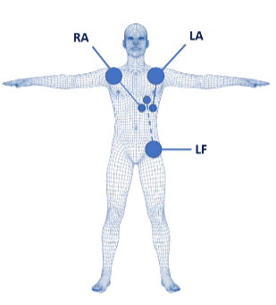

# Adquisición de ECG para análisis de recuperación autonómica post carga cognitiva

## Descripción del proyecto

Este repositorio contiene el avance del proyecto orientado al análisis de la recuperación autonómica posterior a una tarea de carga cognitiva en estudiantes universitarios, utilizando señales de electrocardiografía (ECG) y métricas de variabilidad de la frecuencia cardíaca (HRV).

En este avance se realizó una adquisición piloto con **3 participantes**. Cada participante fue evaluado en tres fases consecutivas:

1. **Reposo basal**
2. **Tarea cognitiva tipo 2-back**
3. **Recuperación fisiológica**

Además, antes del inicio del protocolo se aplicó la **Escala de Estrés Percibido PSS-10** como medida subjetiva del estrés percibido.

> **Nota:** Este avance se enfoca únicamente en la adquisición de datos y en la documentación del protocolo experimental. El procesamiento de señales, la detección de picos R, el cálculo de intervalos R-R y la extracción de métricas HRV serán desarrollados en una etapa posterior.

---

## Objetivo del avance

Realizar una primera adquisición piloto de señales ECG en estudiantes universitarios, siguiendo un protocolo experimental estructurado que permita registrar la actividad cardíaca durante reposo basal, carga cognitiva y recuperación fisiológica.

### Objetivos específicos

* Implementar el protocolo de adquisición de ECG.
* Registrar ECG continuo durante las tres fases experimentales.
* Aplicar la escala PSS-10 antes de la adquisición.
* Aplicar una tarea cognitiva tipo 2-back.
* Registrar el desempeño de la tarea cognitiva.
* Aplicar NASA-TLX al finalizar la tarea cognitiva.
* Verificar la calidad inicial de la señal ECG.
* Organizar los datos para su posterior procesamiento.

---

## Participantes

La adquisición piloto fue realizada en **3 estudiantes universitarios**.

### Criterios de inclusión

* Estudiantes universitarios entre 18 y 30 años.
* Ritmo cardíaco sinusal normal.
* Sin medicación que altere la frecuencia cardíaca.

### Criterios de exclusión

* Antecedentes de arritmias cardíacas.
* Uso de marcapasos.
* Tratamiento con psicofármacos.
* Trastornos activos de ansiedad o depresión.

### Registro de participantes

| Participante | Basal     | Tarea cognitiva | Recuperación | PSS-10   | NASA-TLX |
| ------------ | --------- | --------------- | ------------ | -------- | -------- |
| P01          | Realizado | Realizado       | Realizado    | Aplicado | Aplicado |
| P02          | Realizado | Realizado       | Realizado    | Aplicado | Aplicado |
| P03          | Realizado | Realizado       | Realizado    | Aplicado | Aplicado |


---

## Equipamiento utilizado

La adquisición de señales fisiológicas se realizó utilizando:

* Sistema **BITalino**.
* Sensor de **ECG de una derivación** (2da Derivada).
* Electrodos desechables.
* Software **OpenSignals** para visualización y almacenamiento de datos.

---

## Configuración de electrodos

Los electrodos fueron colocados siguiendo una configuración de tres derivaciones:

| Electrodo        | Ubicación        |
| ---------------- | ---------------- |
| Positivo (+)     | Hombro izquierdo |
| Negativo (-)     | Hombro derecho   |
| Referencia / GND | Cresta ilíaca    |

### Imagen



---

## Protocolo experimental

El protocolo se desarrolló en una única sesión experimental con registro continuo de ECG durante tres fases consecutivas.

Protocolo:

[Archivo del protocolo de adquisición](Archivos/Protocolo_Adquisicio.pdf)


### Resumen del protocolo

| Fase   |                Condición | Duración | Descripción                                                                   |
| ------ | -----------------------: | -------: | ----------------------------------------------------------------------------- |
| Fase 1 |             Reposo basal |    5 min | El participante permanece sentado, en silencio y sin movimientos innecesarios |
| Fase 2 |          Carga cognitiva |    5 min | El participante realiza una tarea cognitiva tipo 2-back                       |
| Fase 3 | Recuperación fisiológica |    5 min | El participante permanece sentado en reposo pasivo después de la tarea        |

### Diagrama del protocolo


---

## Fase 1: Reposo basal

Durante la fase basal, el participante permaneció sentado durante 5 minutos en un ambiente silencioso y controlado.

Indicaciones dadas al participante:

* Evitar movimientos innecesarios.
* No conversar durante el registro.
* No utilizar dispositivos electrónicos.
* Mantener una postura cómoda y estable.

El objetivo de esta fase fue obtener una línea base fisiológica para comparar los cambios producidos durante la tarea cognitiva y durante la recuperación.

### Señal sugerida para agregar

Agregar una imagen de la señal ECG basal de los 3 participantes:

```markdown

```

---

## Fase 2: Tarea cognitiva 2-back

Durante la segunda fase, el participante realizó una tarea cognitiva tipo **N-back**, específicamente una tarea **2-back**, durante 5 minutos.

En esta tarea, el participante debía identificar si el estímulo actual coincidía con el presentado dos posiciones antes en la secuencia.

Durante toda esta fase se mantuvo el registro continuo de ECG.

Al finalizar la tarea cognitiva, el participante completó el cuestionario **NASA-TLX**, utilizado para evaluar la carga cognitiva percibida durante la actividad.

### Variables asociadas a esta fase

* Señal ECG durante carga cognitiva.
* Accuracy de la tarea 2-back.
* Puntaje total NASA-TLX.

### Señales e imágenes sugeridas

Agregar una imagen de la señal ECG durante la tarea cognitiva de los participantes:

```markdown

```

Agregar una captura de la tarea 2-back:

```markdown

```

---

## Fase 3: Recuperación fisiológica

Después de finalizar la tarea cognitiva, el participante permaneció sentado en reposo pasivo durante 5 minutos.

Durante esta fase se continuó registrando ECG con el objetivo de analizar la recuperación autonómica posterior al esfuerzo cognitivo.

Esta etapa permitirá evaluar posteriormente si las métricas de HRV retornan hacia valores cercanos al estado basal.

### Señal sugerida para agregar

Agregar una imagen de la señal ECG durante recuperación de cada participante:

```markdown

```
---

## Cuestionarios aplicados

### Escala de Estrés Percibido PSS-10

Antes de iniciar la adquisición, cada participante completó la **Escala de Estrés Percibido PSS-10**.

Este cuestionario fue aplicado para obtener una medida subjetiva del estrés percibido durante el último mes. El puntaje total podrá ser utilizado posteriormente como variable complementaria en el análisis de la recuperación autonómica.

Enlace de las preguntas del Formulario:

```bash
docs/forms/pss10_form.pdf
```

Enlace del formulario digital:

```markdown
[PSS-10 - Formulario aplicado](PEGAR_AQUI_LINK_DEL_GOOGLE_FORMS)
```

### NASA-TLX

Después de la tarea cognitiva 2-back, cada participante completó el cuestionario **NASA-TLX**, utilizado para evaluar la carga cognitiva percibida.

Se recomienda guardar el formulario en:

```bash
docs/forms/nasa_tlx_form.pdf
```

Y enlazarlo en el README:

```markdown
[NASA-TLX - Formulario aplicado](docs/forms/nasa_tlx_form.pdf)
```

---

## Variables registradas

Para cada participante se registraron o se planea registrar las siguientes variables:

| Variable                      | Descripción                                                 |
| ----------------------------- | ----------------------------------------------------------- |
| ID del participante           | Código anónimo del participante, por ejemplo P01, P02 o P03 |
| Edad                          | Edad del participante                                       |
| Sexo                          | Sexo reportado por el participante                          |
| Puntaje PSS-10                | Estrés percibido antes de la adquisición                    |
| Señal ECG cruda basasl        | Señal registrada con BITalino/OpenSignals                   |
| Señal ECG cruda Cognitiva     | Señal registrada con BITalino/OpenSignals                   |
| Señal ECG cruda Recuperacion  | Señal registrada con BITalino/OpenSignals                   |
| Intervalos R-R                | Intervalos entre picos R detectados                         |
| RMSSD basal                   | Métrica HRV durante reposo basal                            |
| RMSSD durante carga cognitiva | Métrica HRV durante tarea 2-back                            |
| RMSSD durante recuperación    | Métrica HRV durante reposo posterior                        |
| Accuracy 2-back               | Desempeño del participante en la tarea cognitiva            |
| Puntaje NASA-TLX              | Carga cognitiva percibida                                   |

---


## Referencias

* Cohen
* adasa
