# Laboratorio EEG de 2 canales: ICA y análisis espectral con Welch

Este repositorio contiene el procesamiento de señales EEG adquiridas con BITalino usando un pipeline en Python/Colab basado en **MNE**, **ICA** y **Welch**. El objetivo principal fue visualizar artefactos fisiológicos, extraer potencia espectral por bandas EEG y comparar distintas condiciones experimentales frente a una condición basal.

---

## 1. Descripción general

En este laboratorio se trabajó con una señal EEG de **2 canales** registrada en diferentes condiciones experimentales. El procesamiento incluyó lectura de archivos `.txt`, conversión de unidades, filtrado, detección de ventanas contaminadas por artefactos, análisis exploratorio con ICA y estimación de la densidad espectral de potencia mediante Welch.

El análisis se realizó en el notebook:

```text
pipeline_eeg_2canales_mne_welch_ica.ipynb
```

---

## 2. Adquisición de señales

La adquisición se realizó con **BITalino EEG**, usando **2 canales** nombrados en el código como:

```text
Fp1
Fp2
```

La frecuencia de muestreo configurada fue:

```text
FS = 1000 Hz
```

Las condiciones registradas fueron:

| Condición en el código | Archivo de entrada | Descripción |
|---|---|---|
| `basal` | `Basal_1.txt` | Señal EEG en reposo. |
| `punto_fijo` | `Abrir_PFijo.txt` | Señal EEG observando un punto fijo. |
| `parpadeo` | `Parpadeo.txt` | Condición de control para artefacto ocular. |
| `masticacion` | `Mastic.txt` | Condición de control para artefacto muscular. |
| `musica_relax` | `Music_Relax.txt` | Señal EEG durante música relajante. |
| `musica_estres` | `Music_Estres.txt` | Señal EEG durante música estresante. |

---

## 3. Estructura sugerida del repositorio

Para que el README muestre correctamente las imágenes y tablas en GitHub, se recomienda mantener esta estructura:

```text
.
├── README.md
├── pipeline_eeg_2canales_mne_welch_ica.ipynb
├── data/
│   ├── Basal_1.txt
│   ├── Abrir_PFijo.txt
│   ├── Parpadeo.txt
│   ├── Mastic.txt
│   ├── Music_Relax.txt
│   └── Music_Estres.txt
└── Archivos/
    ├── window_features_all_conditions.csv
    ├── window_features_with_artifact_flags.csv
    ├── artifact_report.csv
    ├── summary_bandpowers_clean.csv
    ├── comparison_vs_basal.csv
    ├── time_basal.png
    ├── time_punto_fijo.png
    ├── time_parpadeo.png
    ├── time_masticacion.png
    ├── time_musica_relax.png
    ├── time_musica_estres.png
    ├── psd_clean_Fp1.png
    ├── psd_clean_Fp2.png
    ├── ica_muscle_scores.png
    ├── ica_sources_basal.png
    ├── ica_sources_punto_fijo.png
    ├── ica_sources_parpadeo.png
    ├── ica_sources_masticacion.png
    ├── ica_sources_musica_relax.png
    ├── ica_sources_musica_estres.png
    ├── bar_rel_theta_4_8_Fp1.png
    ├── bar_rel_alpha_8_13_Fp1.png
    ├── bar_rel_beta_13_30_Fp1.png
    ├── bar_rel_gamma_baja_30_45_Fp1.png
    ├── bar_rel_theta_4_8_Fp2.png
    ├── bar_rel_alpha_8_13_Fp2.png
    ├── bar_rel_beta_13_30_Fp2.png
    └── bar_rel_gamma_baja_30_45_Fp2.png
```

> Nota: para que las imágenes se muestren en GitHub, los `.png` y `.csv` deben estar dentro de `Archivos/`. Si se cambia el nombre de la carpeta de salida, también deben actualizarse las rutas de las imágenes en este README.

---

## 4. Configuración principal del notebook

La configuración usada en el notebook fue:

| Parámetro | Valor usado |
|---|---:|
| Frecuencia de muestreo | `1000 Hz` |
| Canales EEG | `Fp1`, `Fp2` |
| Columnas usadas | Últimas 2 columnas del archivo (`CHANNEL_COLUMNS = [-2, -1]`) |
| Unidad de entrada | `uV` |
| Filtro pasa banda | `1–45 Hz` |
| Notch | No aplicado (`APPLY_NOTCH = False`) |
| Tamaño de ventana | `4 s` |
| Solapamiento | `50 %` |
| Segmento Welch | `2 s` |
| ICA | Activado para exploración (`RUN_ICA = True`) |
| Aplicación de ICA | Desactivada por seguridad (`APPLY_ICA = False`) |

---

## 5. Flujo de procesamiento

El flujo general del laboratorio fue:

```text
Archivos .txt de BITalino
        ↓
Lectura de datos numéricos
        ↓
Selección de 2 canales EEG
        ↓
Conversión de unidades a voltios para MNE
        ↓
Filtrado pasa banda 1–45 Hz
        ↓
Visualización temporal de señales
        ↓
Extracción de características por ventanas
        ↓
Detección de ventanas con posible artefacto
        ↓
Estimación PSD con Welch
        ↓
Cálculo de potencia por bandas EEG
        ↓
Comparación frente a basal
        ↓
Exploración de componentes con ICA
        ↓
Exportación de tablas CSV y figuras PNG
```

---

## 6. Preprocesamiento

El preprocesamiento incluyó:

1. Lectura flexible de archivos `.txt`, ignorando líneas comentadas con `#`.
2. Selección de los dos canales EEG desde las últimas columnas del archivo.
3. Conversión de unidades a voltios, formato requerido por MNE.
4. Creación de objetos `RawArray` de MNE.
5. Filtrado pasa banda de **1 a 45 Hz**.
6. Revisión visual inicial mediante gráficas temporales.

El filtrado se aplicó para conservar las bandas EEG principales y reducir componentes de muy baja frecuencia o ruido de alta frecuencia.

---

## 7. Visualización temporal de señales

El notebook genera figuras temporales de los primeros segundos de cada condición. Estas gráficas permiten inspeccionar amplitud, forma de onda y presencia de artefactos evidentes.

### Señal basal

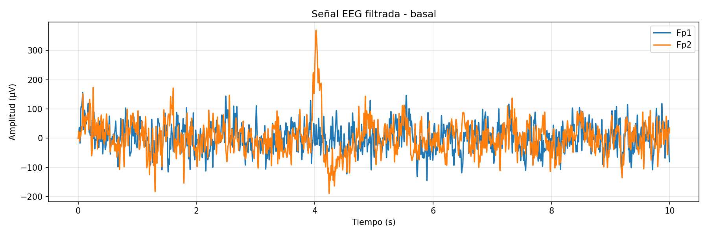

### Punto fijo

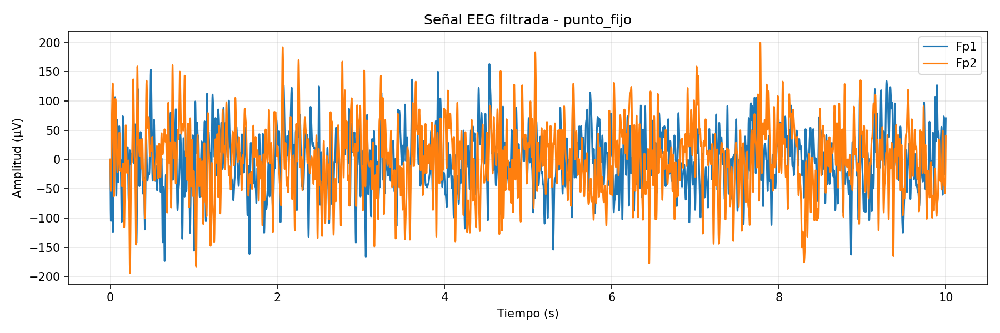

### Parpadeo

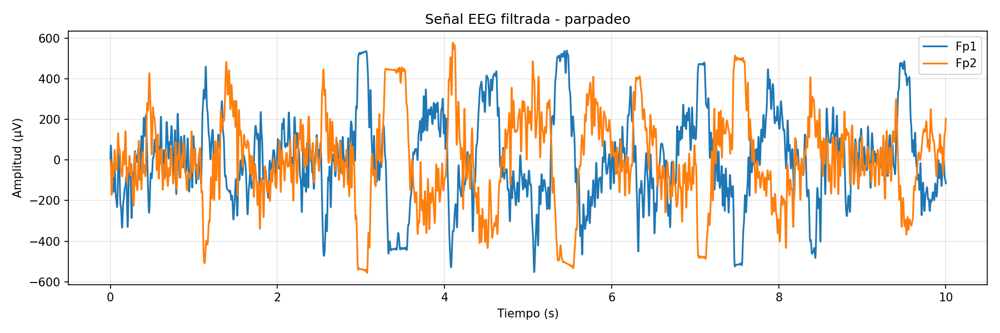

### Masticación

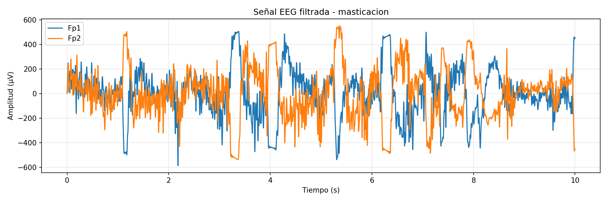

### Música relajante

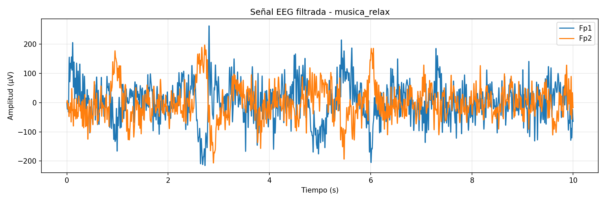

### Música estresante

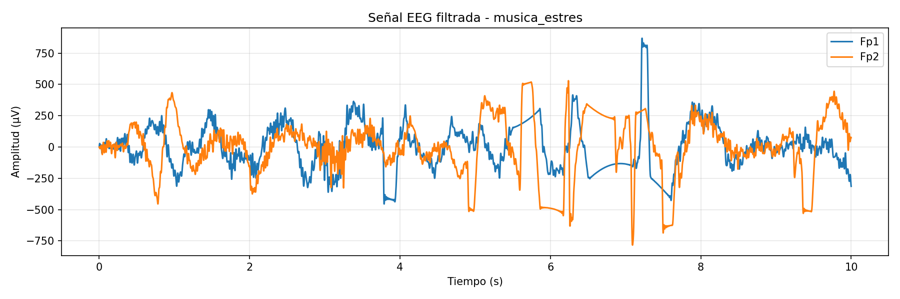

---

## 8. Artefactos

Las condiciones de **parpadeo** y **masticación** se usaron como condiciones de control para observar artefactos fisiológicos.

| Condición | Tipo de artefacto esperado | Descripción |
|---|---|---|
| `parpadeo` | Ocular | Deflexiones de mayor amplitud asociadas al movimiento ocular y parpadeo. |
| `masticacion` | Muscular | Componentes de mayor frecuencia asociados a actividad muscular facial. |

Para detectar ventanas posiblemente contaminadas, el notebook calcula:

- Amplitud pico a pico (`p2p_uv`).
- RMS de la señal (`rms_uv`).
- Potencia por bandas EEG.
- Potencia en gamma baja como indicador de posible actividad muscular.
- Umbrales robustos basados en MAD.

Las ventanas marcadas como contaminadas no se usan en el análisis limpio principal.

---

## 9. Tabla de artefactos

El archivo `artifact_report.csv` resume la cantidad de ventanas detectadas como contaminadas por condición y canal.

```text
Archivos/artifact_report.csv
```

Este archivo contiene columnas como:

| Columna | Descripción |
|---|---|
| `condition` | Condición experimental. |
| `channel` | Canal EEG analizado. |
| `n_windows` | Número total de ventanas. |
| `bad_windows` | Número de ventanas marcadas como contaminadas. |
| `pct_bad_windows` | Porcentaje de ventanas contaminadas. |
| `mean_p2p_uv` | Amplitud pico a pico promedio. |
| `mean_gamma_30_45` | Potencia promedio en gamma baja. |

---

## 10. ICA

Se exploró el uso de **ICA**, análisis de componentes independientes, para identificar posibles componentes asociados a artefactos musculares.

El notebook concatena las señales filtradas de todas las condiciones y ajusta ICA con un máximo de **2 componentes**, debido a que solo existen 2 canales EEG.

```text
n_components = 2
method = "fastica"
```

La remoción automática de componentes no se aplicó por defecto:

```text
APPLY_ICA = False
```

Esto se hizo porque, con solo 2 canales, ICA tiene una capacidad limitada para separar fuentes independientes. Por ello, los componentes deben inspeccionarse visualmente antes de decidir si alguno se elimina.

### Score de componente muscular

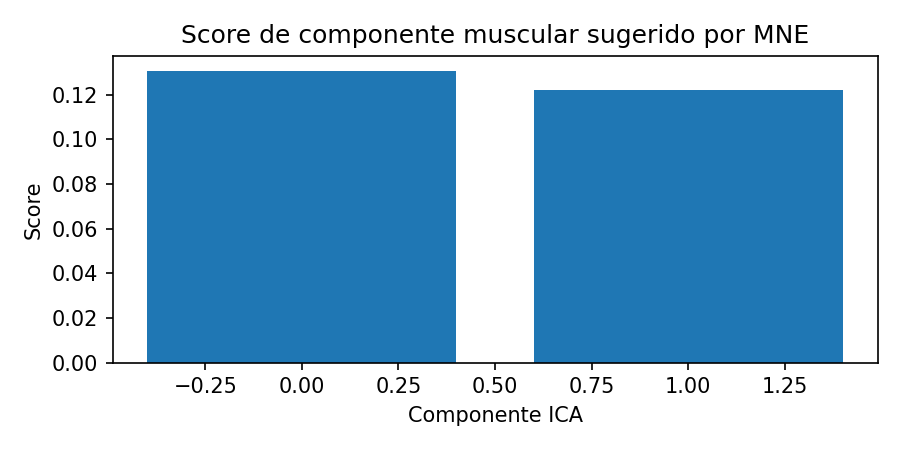

### Fuentes ICA por condición

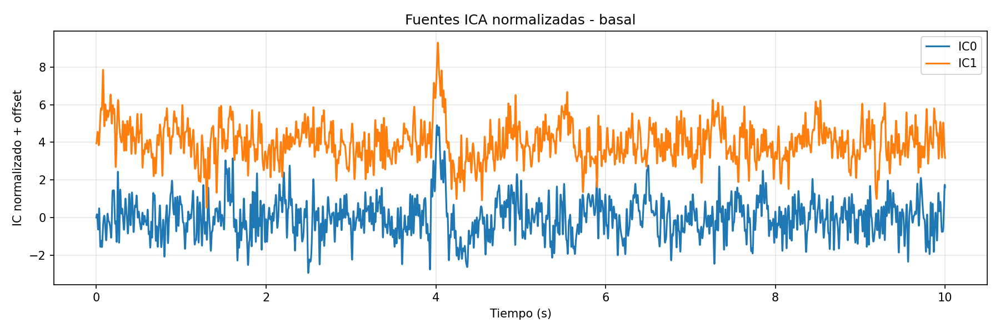

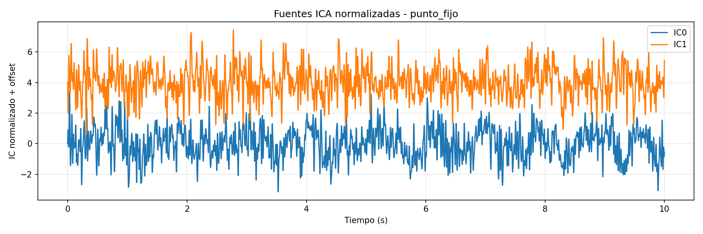

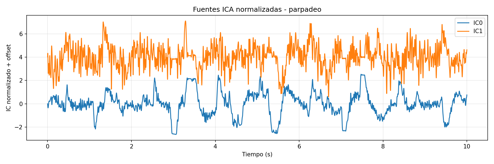

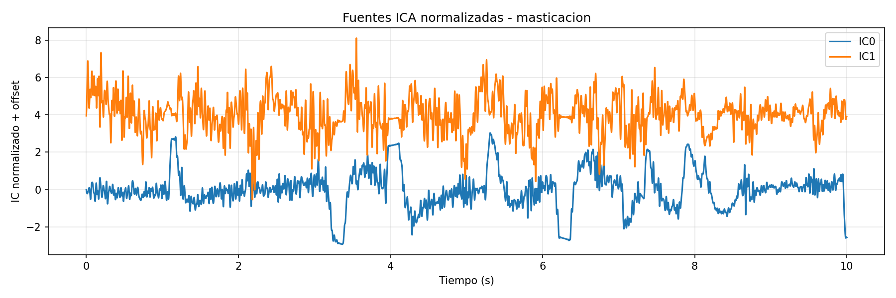

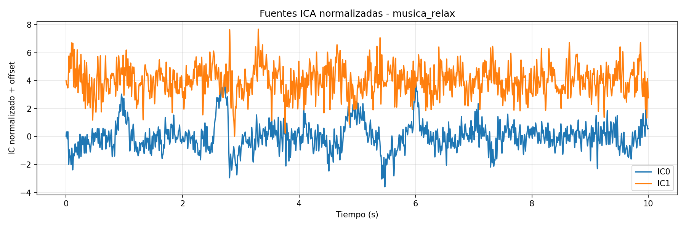

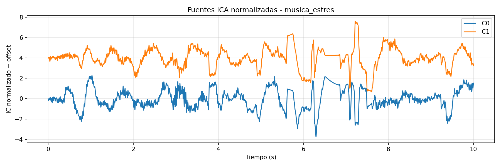

> Nota: los archivos `window_features_after_ica.csv`, `summary_bandpowers_after_ica.csv` y las figuras `time_*_after_ica.png` solo se generan si se cambia `APPLY_ICA = True` y se define manualmente `ICA_EXCLUDE_MANUAL`.

---

## 11. Análisis espectral con Welch

Se aplicó el método de **Welch** para estimar la densidad espectral de potencia, PSD, por condición y canal. El análisis se realizó usando ventanas de 4 segundos con 50 % de solapamiento y segmentos de Welch de 2 segundos.

Las bandas analizadas fueron:

| Banda | Rango |
|---|---:|
| Theta | 4–8 Hz |
| Alfa | 8–13 Hz |
| Beta | 13–30 Hz |
| Gamma baja | 30–45 Hz |

### PSD promedio del canal Fp1

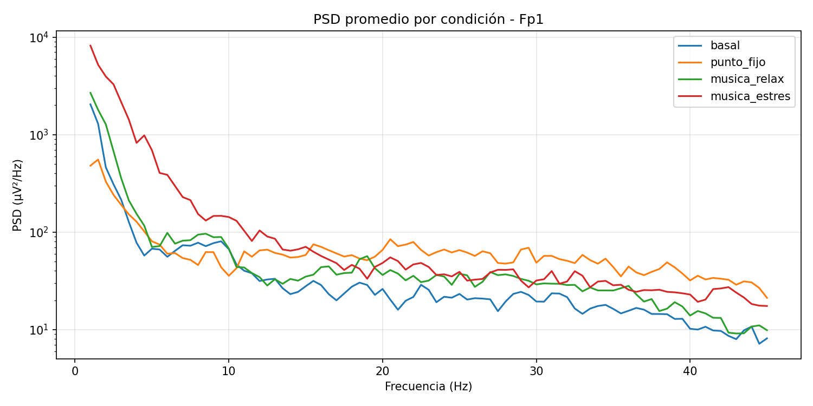

### PSD promedio del canal Fp2

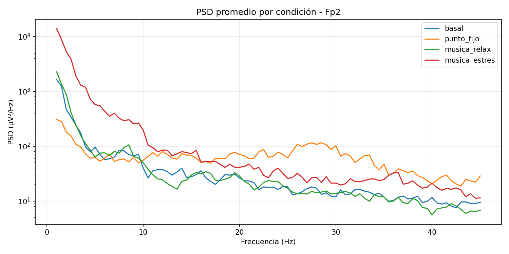

---

## 12. Potencia por bandas EEG

El archivo `summary_bandpowers_clean.csv` resume la potencia promedio por banda EEG, condición y canal, usando únicamente las ventanas consideradas limpias.

```text
Archivos/summary_bandpowers_clean.csv
```

Este archivo incluye potencias absolutas y relativas para:

- Theta: `theta_4_8`
- Alfa: `alpha_8_13`
- Beta: `beta_13_30`
- Gamma baja: `gamma_baja_30_45`
- Potencias relativas: `rel_theta_4_8`, `rel_alpha_8_13`, `rel_beta_13_30`, `rel_gamma_baja_30_45`

### Potencia relativa theta

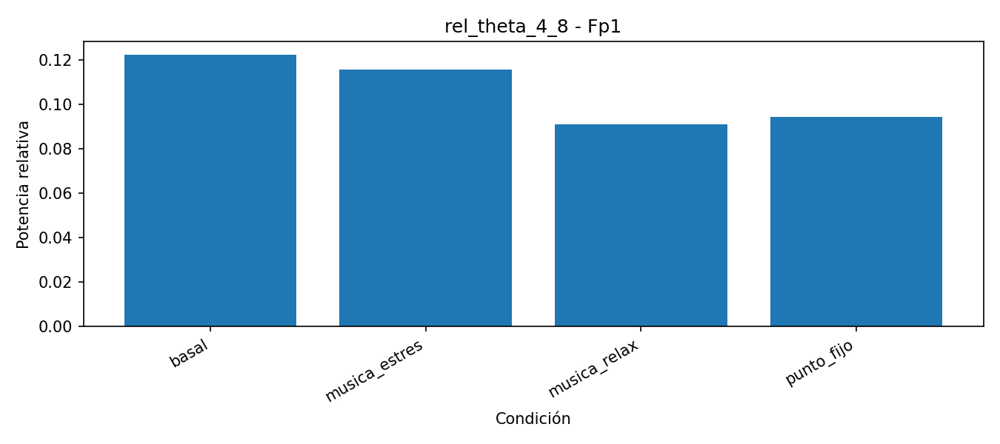

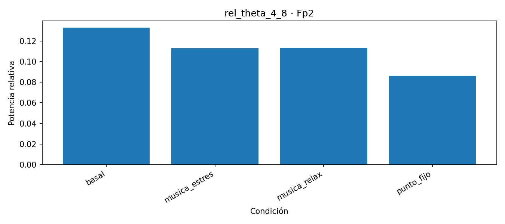

### Potencia relativa alfa

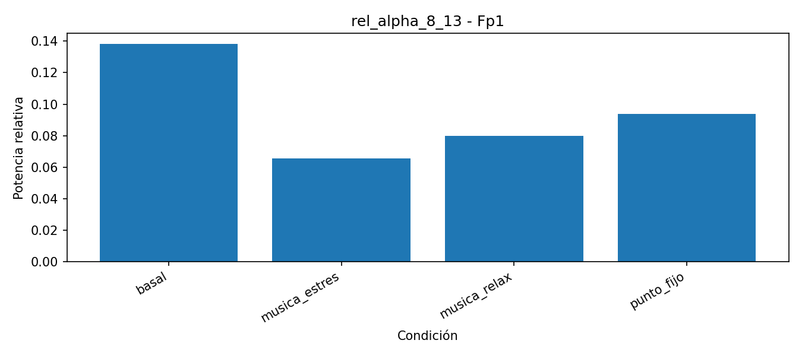

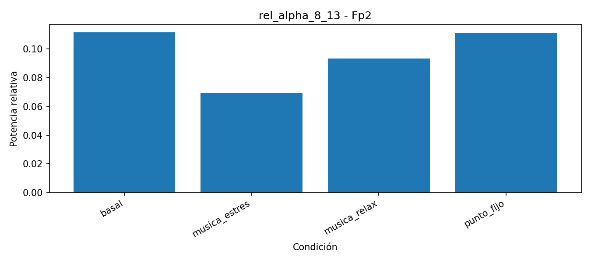

### Potencia relativa beta

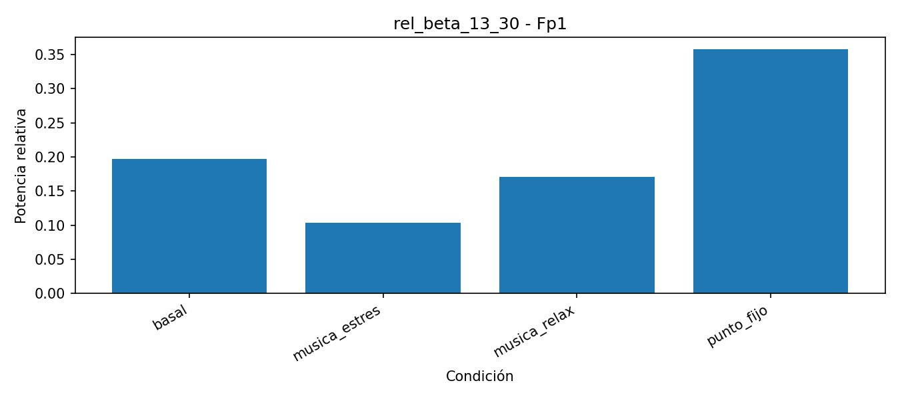

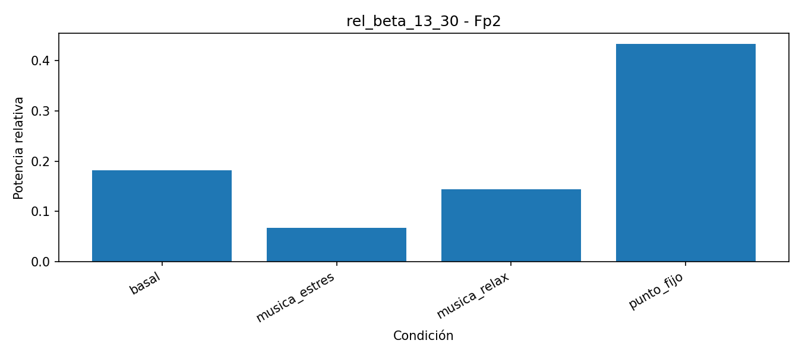

### Potencia relativa gamma baja

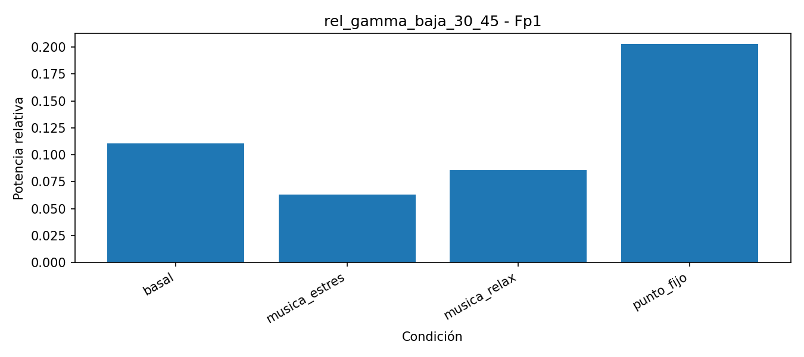

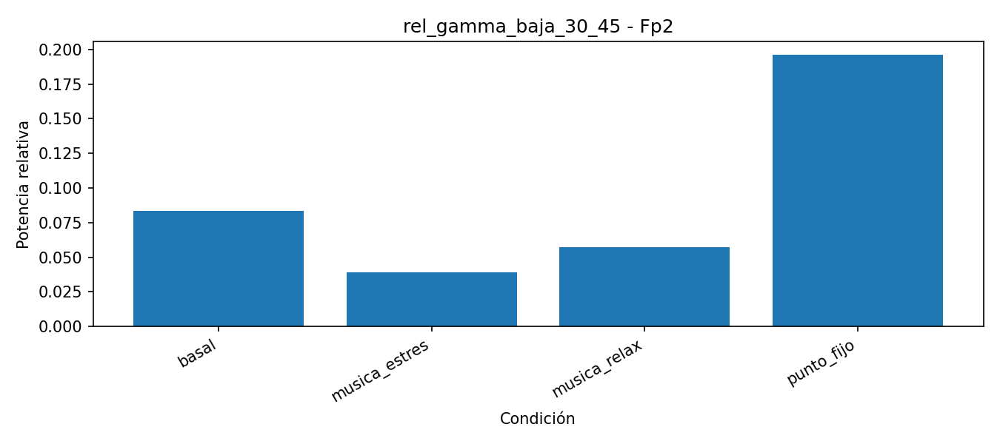

---

## 13. Comparación frente a basal

Se compararon las condiciones principales frente a la condición basal:

- Basal vs punto fijo.
- Basal vs música relajante.
- Basal vs música estresante.

El archivo generado fue:

```text
Archivos/comparison_vs_basal.csv
```

Este archivo expresa el cambio porcentual de cada banda respecto a basal para cada canal. Las columnas siguen el formato:

```text
delta_pct_vs_basal_<nombre_de_banda>
```

Por ejemplo:

```text
delta_pct_vs_basal_alpha_8_13
delta_pct_vs_basal_rel_beta_13_30
```

---

## 14. Archivos generados

### Tablas CSV

| Archivo | Descripción |
|---|---|
| `window_features_all_conditions.csv` | Características por ventana para todas las condiciones y canales. |
| `window_features_with_artifact_flags.csv` | Características por ventana con indicadores de artefacto. |
| `artifact_report.csv` | Resumen de ventanas contaminadas por condición y canal. |
| `summary_bandpowers_clean.csv` | Promedio de potencia por bandas usando ventanas limpias. |
| `comparison_vs_basal.csv` | Comparación porcentual de cada condición frente a basal. |
| `window_features_after_ica.csv` | Archivo opcional, solo si se activa la limpieza con ICA. |
| `summary_bandpowers_after_ica.csv` | Archivo opcional, solo si se activa la limpieza con ICA. |

### Figuras PNG

| Tipo de figura | Archivos |
|---|---|
| Señales temporales | `time_basal.png`, `time_punto_fijo.png`, `time_parpadeo.png`, `time_masticacion.png`, `time_musica_relax.png`, `time_musica_estres.png` |
| PSD promedio | `psd_clean_Fp1.png`, `psd_clean_Fp2.png` |
| ICA | `ica_muscle_scores.png`, `ica_sources_*.png` |
| Barras por bandas | `bar_rel_theta_4_8_*.png`, `bar_rel_alpha_8_13_*.png`, `bar_rel_beta_13_30_*.png`, `bar_rel_gamma_baja_30_45_*.png` |

---

## 15. Interpretación general

El análisis temporal permitió observar diferencias visuales entre condiciones y detectar segmentos con artefactos evidentes. Las condiciones de parpadeo y masticación sirvieron como referencia para reconocer artefactos oculares y musculares.

El análisis con Welch permitió estimar la potencia espectral en bandas EEG. A partir de estas bandas se compararon condiciones como reposo, punto fijo, música relajante y música estresante. La comparación frente a basal permitió observar aumentos o disminuciones porcentuales en la potencia de cada banda.

ICA se utilizó únicamente como exploración, ya que la señal cuenta solo con 2 canales. Por esta razón, la eliminación de componentes no debe realizarse automáticamente y requiere inspección visual previa.

---

## 16. Cómo ejecutar el análisis

1. Abrir el notebook en Google Colab.
2. Montar Google Drive.
3. Verificar la ruta de los archivos en `BASE_DIR`.
4. Verificar que los archivos `.txt` tengan los nombres definidos en `FILES`.
5. Ejecutar las celdas en orden.
6. Revisar las figuras generadas en `Archivos/`.
7. Revisar las tablas `.csv` generadas.
8. Inspeccionar visualmente ICA antes de activar cualquier remoción de componentes.

---

## 17. Conclusión

El laboratorio permitió construir un pipeline completo para señales EEG de 2 canales, desde la lectura de archivos de BITalino hasta la extracción de características espectrales. La combinación de revisión visual, detección de artefactos, Welch e ICA exploratorio permitió analizar las diferencias entre condiciones experimentales, manteniendo cuidado metodológico debido a la limitación del bajo número de canales.
