# Informe de Laboratorio 7: Adquisición y análisis de señales EEG

## Descripción general

Este repositorio contiene el informe y los recursos asociados al laboratorio de electroencefalografía (EEG), orientado a observar la señal cerebral en diferentes condiciones experimentales: reposo basal, ojos abiertos, artefactos por parpadeo, artefactos por masticación, música relajante y música estresante.

El objetivo principal del laboratorio es comparar visual y cuantitativamente cómo cambia la señal EEG entre una condición basal controlada y condiciones que pueden modificar la actividad registrada o introducir artefactos fisiológicos.

---

# Informe

## 1. Introducción

La electroencefalografía (EEG) es una técnica no invasiva que permite registrar la actividad eléctrica cerebral mediante sensores colocados sobre el cuero cabelludo. Esta señal puede analizarse en el dominio temporal y en el dominio de la frecuencia para identificar patrones asociados a estados de reposo, atención, relajación o presencia de artefactos.

En este laboratorio se realizó la adquisición de señales EEG bajo seis condiciones experimentales:

1. Condición basal con aislamiento sensorial parcial.
2. Ojos abiertos mirando un punto fijo.
3. Parpadeo voluntario.
4. Masticación.
5. Exposición a música relajante.
6. Exposición a música estresante.

La condición basal se utilizó como referencia inicial. Las condiciones de parpadeo y masticación permitieron observar artefactos fisiológicos asociados a movimiento ocular y actividad muscular. Finalmente, las condiciones con música relajante y música estresante permitieron explorar posibles cambios en la señal EEG ante estímulos auditivos emocionales.

> **Dónde colocar imágenes en esta sección:**  
> Agregar una imagen general del montaje experimental en:
>
> ```markdown
> 
> ```

---

## 2. Métodos

### 2.1 Participante

La adquisición fue realizada en un participante voluntario del grupo durante una sesión de laboratorio. El participante permaneció sentado, procurando reducir movimientos corporales durante las condiciones de reposo y estimulación.

| Variable | Descripción |
|---|---|
| Participante | Participante 01 |
| Edad | 22 |
| Sexo | Femenino |
| Fecha de adquisición | 08/05/2026 |
| Lugar de adquisición | UPCH La Molina |

---

### 2.2 Equipos y materiales

Completar esta sección con los datos reales del laboratorio:

| Elemento | Descripción |
|---|---|
| Sistema EEG |  BITalino (r)evolution Assembled Core BT  |
| Número de canales | 2 |
| Frecuencia de muestreo | 1000 Hz |
| Electrodos utilizados | Electrodos desechables |
| Software de adquisición | OpenSignal |
| Música relajante | Elegida por Usuario |
| Música estresante | Elegida por Usuario |

> **Dónde colocar imagen del equipo:**  
>
> ```markdown
> 
> ```

---

### 2.3 Protocolo experimental

El protocolo consistió en seis etapas consecutivas de adquisición EEG. Primero se registró una condición basal, en la cual el participante permaneció aislado parcialmente de estímulos externos mediante cobertura de ojos y oídos. Luego se registró una condición de ojos abiertos, en la que el participante observó un punto fijo. Posteriormente, se adquirieron señales durante parpadeo voluntario y masticación para observar artefactos fisiológicos. Finalmente, se presentaron estímulos auditivos correspondientes a música relajante y música estresante.

| Orden | Condición | Duración aproximada | Descripción |
|---|---:|---:|---|
| 1 | Basal | 2 min | Participante con ojos y oídos cubiertos para reducir estímulos externos. |
| 2 | Ojos abiertos | 2 min | Participante mirando un punto fijo. |
| 3 | Parpadeo | 1 min | Participante realiza parpadeos voluntarios. |
| 4 | Masticación | 1 min | Participante mastica para inducir artefactos musculares. |
| 5 | Música relajante | 2 min | Participante escucha música asociada a relajación. |
| 6 | Música estresante | 2 min | Participante escucha música asociada a estrés o incomodidad. |

**Diagrama del protocolo**  

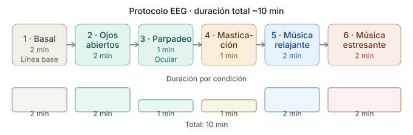

---

### 2.4 Preprocesamiento de la señal

El preprocesamiento debe describir claramente qué se hizo antes de analizar los resultados. Se recomienda reportar:

1. Importación de los archivos EEG.
2. Revisión visual de la señal cruda.
3. Eliminación de segmentos dañados, si corresponde.
4. Aplicación de filtro pasa banda.
5. Aplicación de filtro notch para ruido de red eléctrica, si corresponde.
6. Segmentación por condición experimental.
7. Cálculo de métricas temporales y espectrales.


Instalación de librerias:

```python
from pathlib import Path
import warnings

import numpy as np
import pandas as pd
import matplotlib.pyplot as plt

from scipy.signal import welch, butter, filtfilt, iirnotch, find_peaks
from scipy.stats import ttest_rel

plt.rcParams["figure.figsize"] = (12, 4)
plt.rcParams["axes.grid"] = True
```

---

## 3. Resultados

En esta sección se presentan las figuras obtenidas.

---

### 3.1 Señales EEG crudas y filtradas

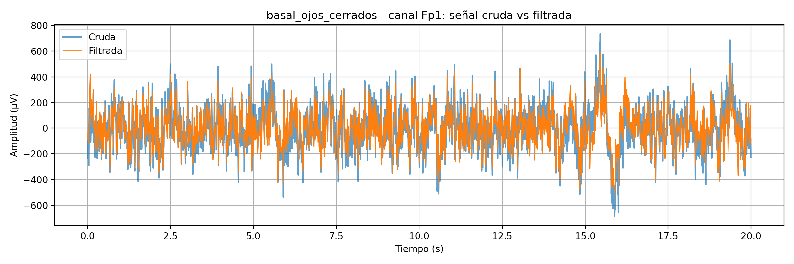
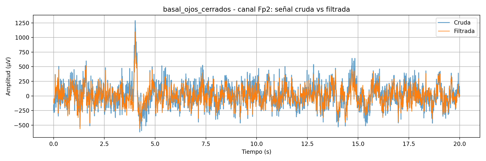

- En la condición basal se espera una señal más estable debido a la reducción de estímulos externos.

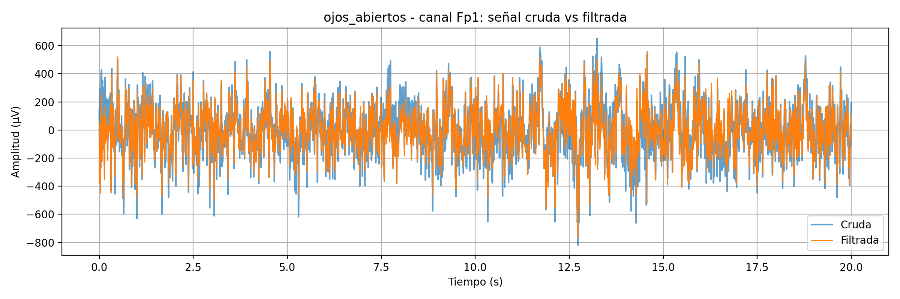
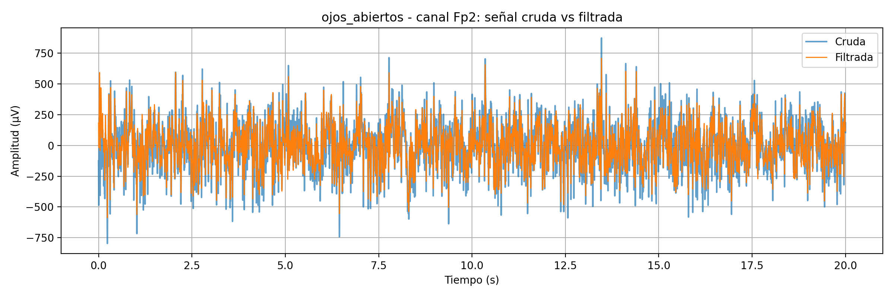

- En ojos abiertos pueden aparecer cambios asociados a mayor entrada visual.

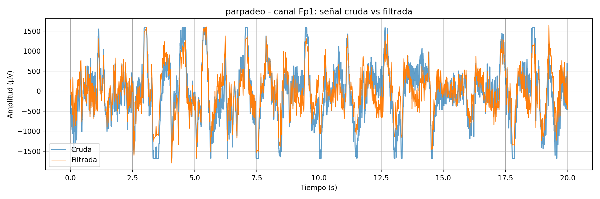
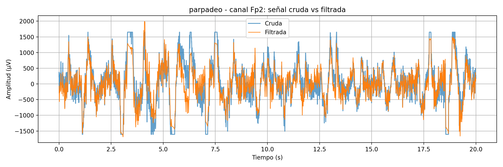

- En parpadeo se esperan deflexiones de gran amplitud producidas por actividad ocular.

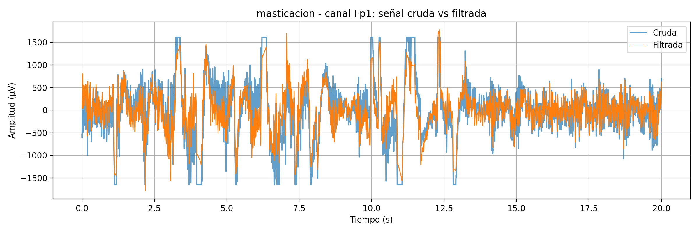
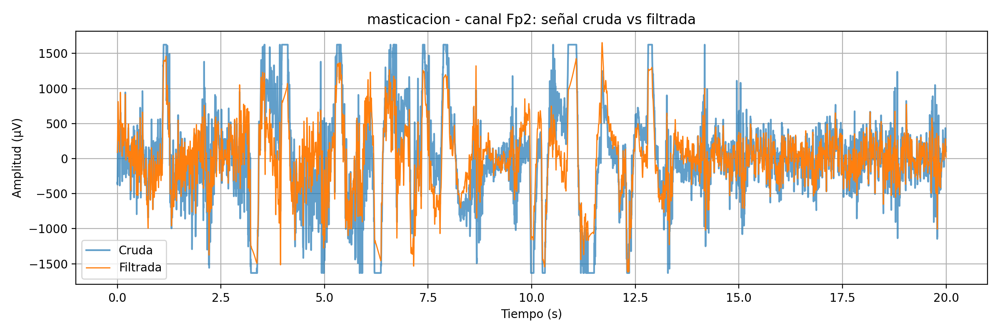

- En masticación se espera mayor contaminación por actividad muscular.

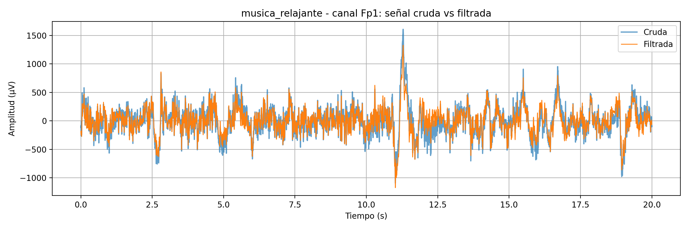 
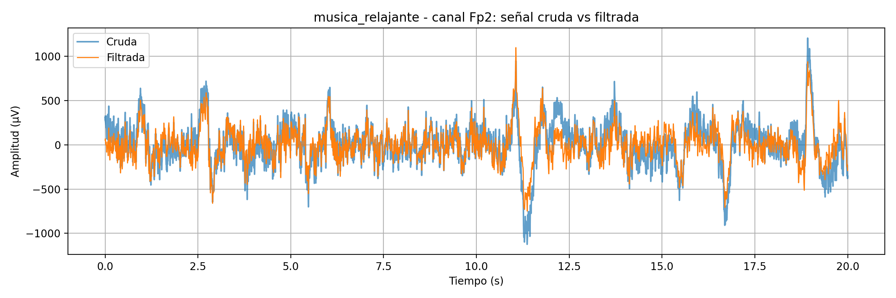 

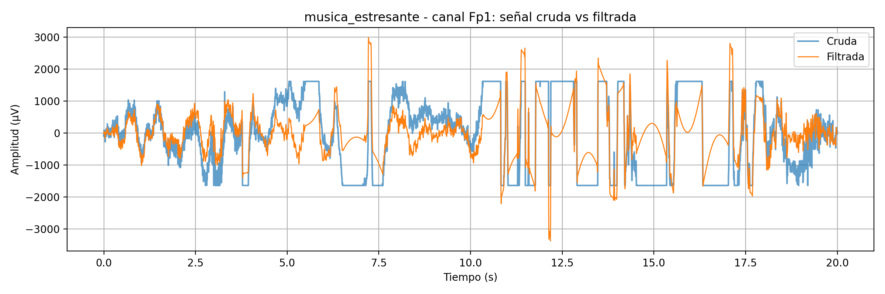
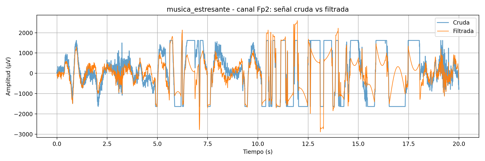

- En música relajante y estresante se pueden explorar cambios de amplitud o potencia espectral.


---

### 3.2 PSD de Welch por condición

Se calcula la densidad espectral de potencia usando Welch con segmento de 2 s. Esto permite observar qué frecuencias tienen mayor contribución en cada condición.

[PSD Welch por condicion FP1 y Fp2](Archivos/psd_welch_por_condicion.csv)

*Gráfico comparativo de alfa relativa por canal*


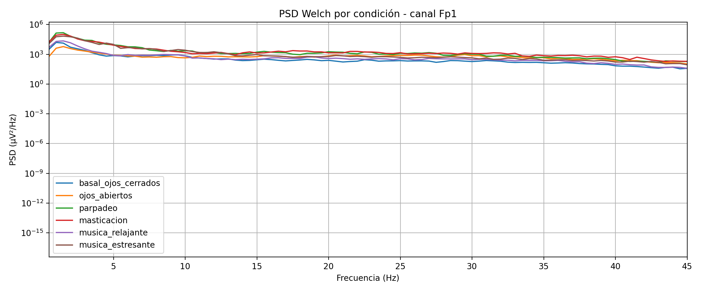
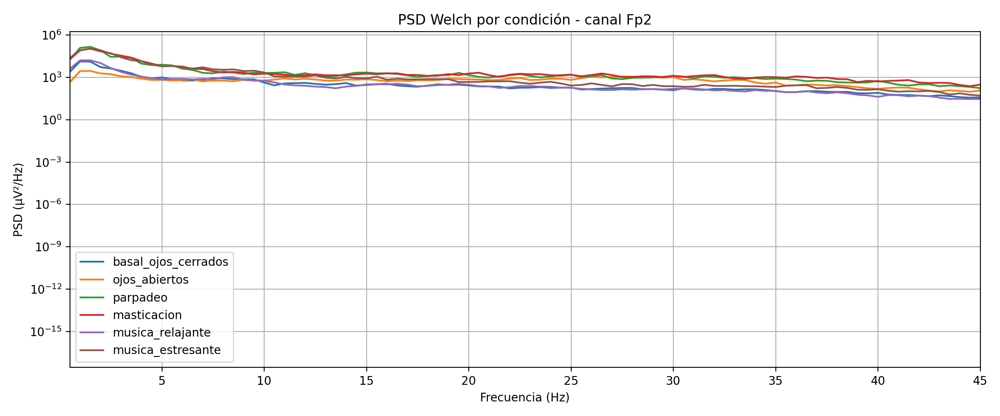

---

### 3.3 Potencia por bandas EEG

Se calcula la potencia absoluta y relativa por ventanas de 2 s en las bandas:

| Banda | Rango aproximado |
|---|---:|
| Delta | 0.5-4 Hz |
| Theta | 4-8 Hz |
| Alfa | 8-13 Hz |
| Beta | 13-30 Hz |
| Gamma | 30-45 Hz |

[Potencia de bandas por epoca](Archivos/potencia_bandas_por_epoca.csv)

[Resumen Potencia de bandas por epoca](Archivos/resumen_potencia_bandas.csv)


---

### 3.4 Comparación de potencia alfa: ojos cerrados vs ojos abiertos
Se usa la condición basal como equivalente de ojos cerrados / aislamiento parcial y se compara contra la condición ojos abiertos. La comparación se realiza con potencia alfa absoluta y relativa por ventanas de 2 s.

[Comparacion de potencia Alfa](Archivos/test_alpha_ojos_cerrados_vs_abiertos.csv)

*Gráfico comparativo de alfa relativa por canal*

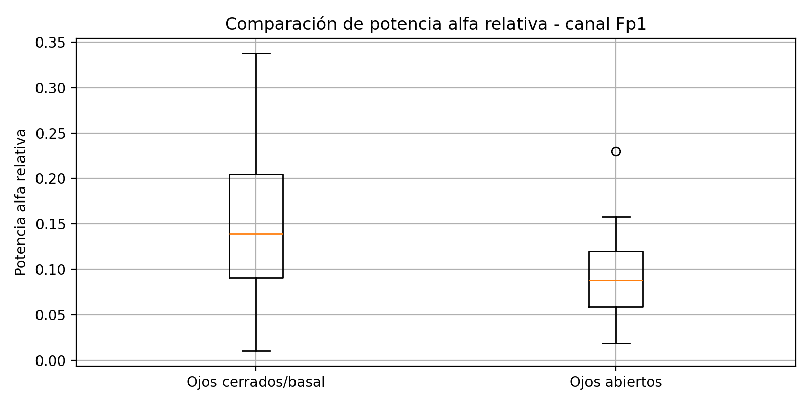
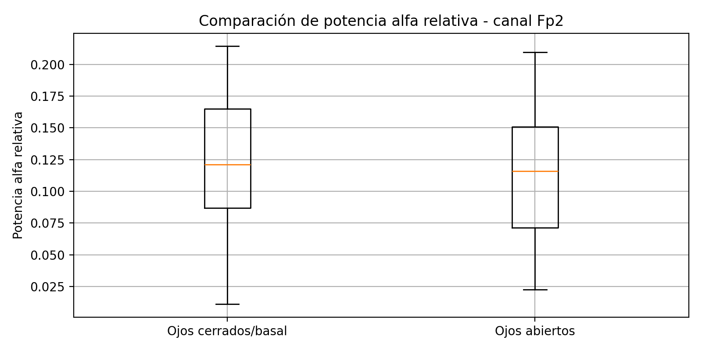

---

### 3.5 Incremento de beta durante condición de carga/estrés
Como el protocolo descrito no incluye una tarea cognitiva clásica, este notebook usa por defecto:
-Condición basal/comparación: musica_relajante
-Condición de carga/estrés: musica_estresante

[Actividad beta de carga/estres](Archivos/test_beta_relajante_vs_estresante.csv)

*Gráfico comparativo de beta relativa por canal*

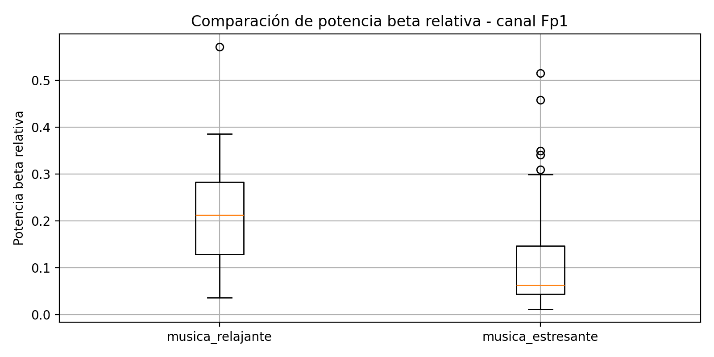
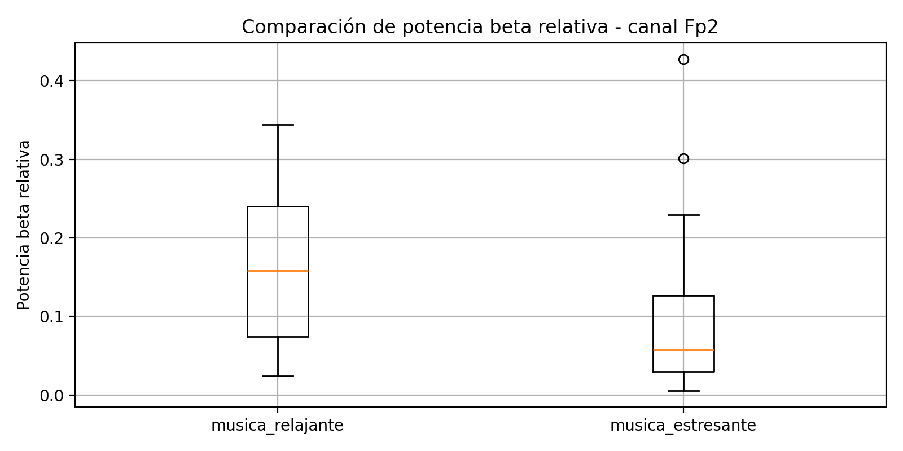


---

### 3.6 Detección de artefactos de parpadeo
El algoritmo busca picos en la señal centrada respecto a su mediana. Se contabilizan picos cuya amplitud absoluta supere 80 µV, separados al menos 0.25 s.

[Conteo de artefactos](Archivos/conteo_artefactos_parpadeo.csv)

*Gráfico de detección de artefactos*

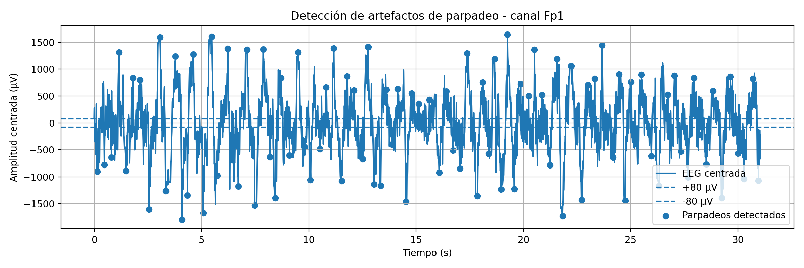
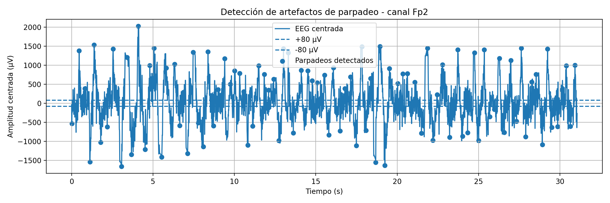


---

### 3.7 Comparación Fp1 vs Fp2
La comparación se hace por potencia relativa de bandas.

[comparacion Fp1 vs Fp2](Archivos/comparacion_Fp1_Fp2.csv)

*Gráficos de comparacion Fp1 vs Fp2*

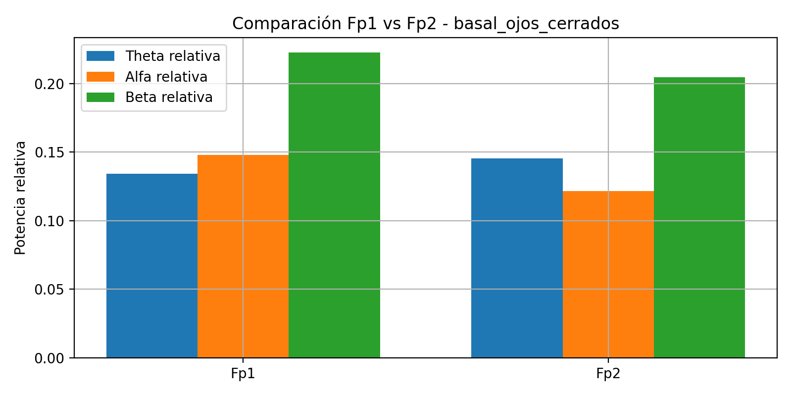
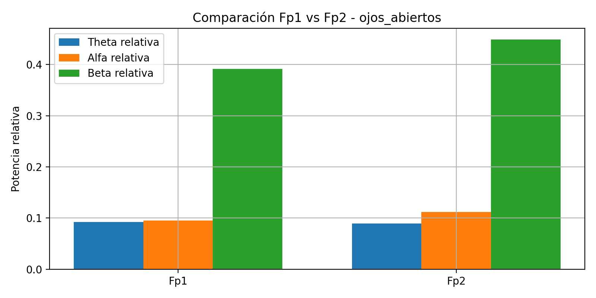
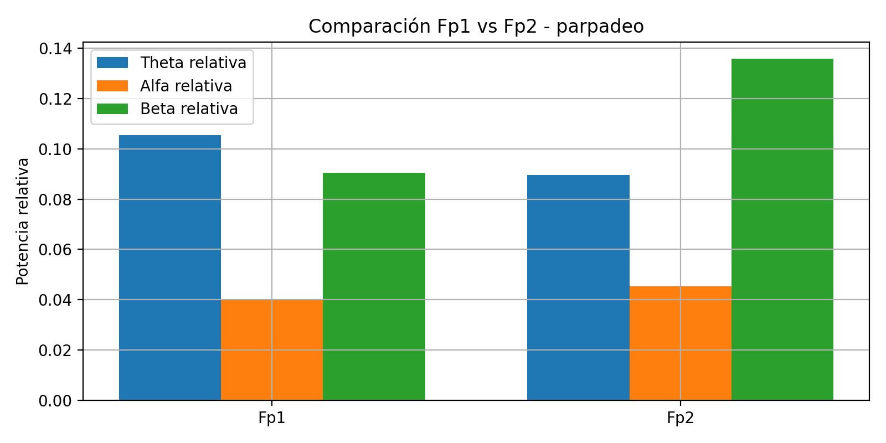
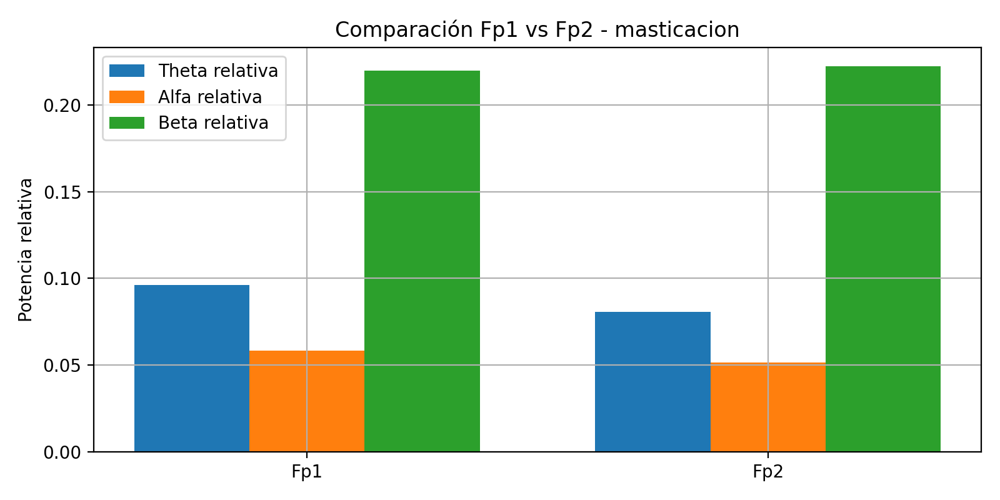
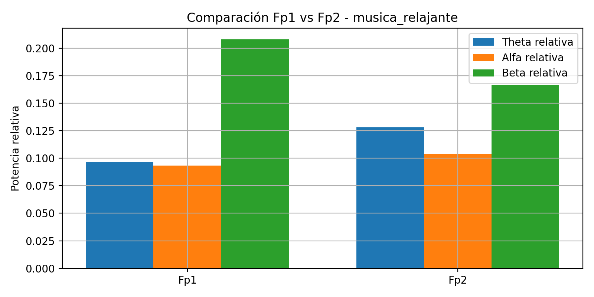
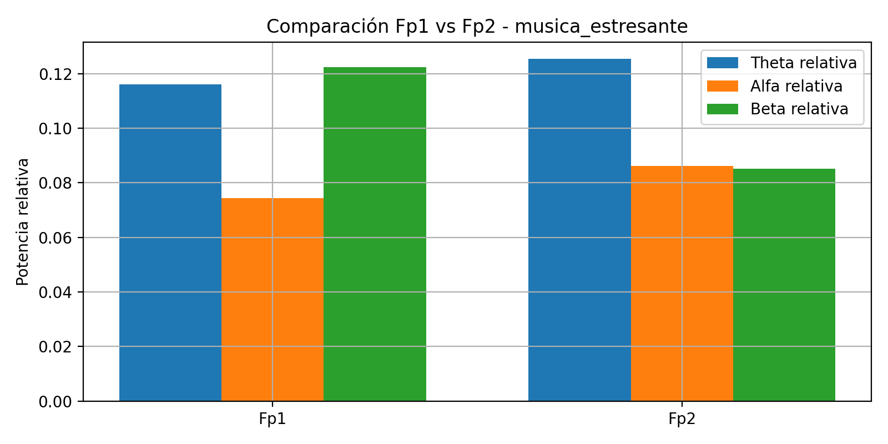


---

## 4. Discusión

### 4.1 ¿Qué banda de frecuencia predomina al cerrar los ojos?

En la condición basal con ojos cerrados se observó que la banda con mayor potencia relativa fue **delta** en ambos canales: 0.395 en Fp1 y 0.455 en Fp2. Sin embargo, este resultado debe interpretarse con cautela. En registros EEG frontales, una alta potencia en bajas frecuencias puede estar influenciada por artefactos lentos, movimiento, deriva de línea base, cambios de impedancia o actividad ocular residual [6], [7].

A pesar de que delta fue la banda predominante en términos relativos, también se observó un comportamiento compatible con lo esperado para la banda alfa. En Fp1, la potencia alfa relativa fue mayor durante ojos cerrados que durante ojos abiertos, con una diferencia estadísticamente significativa. Esto coincide con la literatura, donde se describe que el cierre de ojos suele incrementar la actividad alfa, especialmente en regiones posteriores, aunque también puede producir cambios distribuidos en otras bandas de frecuencia [1], [2], [3]. En Fp2, la diferencia de alfa relativa entre ojos cerrados y ojos abiertos no fue significativa, lo cual puede deberse a diferencias de contacto, ruido, asimetría entre canales o sensibilidad de la región frontal a artefactos oculares [6], [7].

Por lo tanto, para este registro se puede afirmar que la banda predominante fue delta, pero el hallazgo fisiológicamente más relevante fue el aumento significativo de alfa relativa en Fp1 durante la condición de ojos cerrados.

---

### 4.2 ¿Qué filtro es imprescindible para EEG y por qué?

El filtro más importante en EEG es el **filtro pasa banda**, porque permite conservar el rango de frecuencias de interés y reducir componentes no deseadas, como deriva de línea base, componentes de muy baja frecuencia, ruido de alta frecuencia y parte de la actividad no cerebral. En este laboratorio, el módulo EEG de BITalino ya incorpora un filtro hardware pasabanda de aproximadamente 0.8-48 Hz, lo cual es adecuado para estudiar bandas EEG como theta, alfa y beta [10], [11].

Además, en EEG suele considerarse el uso de un **filtro notch** para eliminar interferencia de red eléctrica de 50 o 60 Hz. Sin embargo, en este caso no fue imprescindible aplicar un notch de 60 Hz, porque el propio ancho de banda del sensor llega aproximadamente hasta 48 Hz. Aun así, es importante mencionar que el uso de filtros debe realizarse cuidadosamente, ya que un filtrado agresivo puede distorsionar la señal o afectar la interpretación temporal y espectral [4], [5].

En este análisis se aplicó un filtro pasa banda digital complementario para estandarizar el procesamiento de las señales antes del cálculo de PSD y potencia por bandas.

---

### 4.3 ¿Puedes modular conscientemente tu señal EEG? Da un ejemplo.

Sí, algunas características de la señal EEG pueden modificarse de manera consciente o voluntaria, aunque no siempre de forma precisa ni inmediata. Un ejemplo simple es el cambio entre ojos cerrados y ojos abiertos. Al cerrar los ojos, suele aumentar la actividad alfa, mientras que al abrirlos puede disminuir debido al procesamiento visual y al aumento de atención hacia el entorno [1], [2].

Otro ejemplo más avanzado es el **neurofeedback EEG**, donde una persona recibe retroalimentación en tiempo real sobre alguna característica de su señal cerebral, como la potencia alfa, beta o el ritmo sensorimotor. Con entrenamiento, algunas personas pueden aprender a modificar ciertos patrones de actividad EEG [8], [9]. Sin embargo, esta modulación depende del protocolo, del participante y de la calidad de la señal registrada.

En el presente laboratorio, el ejemplo más claro de modulación voluntaria fue el parpadeo, pero este debe considerarse un artefacto ocular y no una modulación cerebral pura. En cambio, el cambio entre ojos cerrados y ojos abiertos representa un mejor ejemplo de modulación fisiológica observable en EEG [1], [6].

---

### 4.4 ¿Se observan diferencias entre Fp1 y Fp2? ¿Por qué podrían ocurrir?

Sí, se observaron diferencias entre Fp1 y Fp2 en algunas condiciones. Por ejemplo, durante ojos abiertos, Fp2 presentó una potencia beta relativa mayor que Fp1. También se observaron diferencias en la potencia alfa relativa durante la condición basal, donde Fp1 presentó mayor alfa relativa que Fp2.

Estas diferencias pueden deberse a factores fisiológicos y técnicos. Desde el punto de vista fisiológico, Fp1 y Fp2 corresponden a regiones frontopolares izquierda y derecha dentro del sistema internacional 10-20, por lo que podrían registrar actividad ligeramente distinta [12]. Sin embargo, en este laboratorio la interpretación debe ser cautelosa, porque los electrodos frontales son muy sensibles a parpadeos, movimientos oculares y actividad muscular facial [6], [7], [11].

Desde el punto de vista técnico, las diferencias pueden explicarse por contacto desigual de los electrodos, diferencias de impedancia, colocación no exactamente simétrica, referencia, cables o ruido local. La literatura sobre artefactos EEG señala que la mala impedancia electrodo-piel, el mal contacto, los parpadeos, los movimientos oculares y la actividad muscular pueden contaminar la señal y producir diferencias aparentes entre canales [6], [7].

Por ello, aunque sí se observan diferencias entre Fp1 y Fp2, no deben interpretarse directamente como diferencias cerebrales hemisféricas sin antes verificar impedancia, calidad de contacto y presencia de artefactos.
---

## 5. Conclusiones

En este laboratorio se adquirieron y analizaron señales EEG en los canales frontales Fp1 y Fp2 usando el módulo EEG de BITalino. Las señales fueron registradas en seis condiciones: basal con ojos cerrados, ojos abiertos, parpadeo, masticación, música relajante y música estresante.

Durante la condición basal con ojos cerrados predominó la banda delta en ambos canales. Sin embargo, este resultado debe interpretarse con cautela, ya que los registros frontales pueden estar influenciados por artefactos lentos, movimiento, actividad ocular o cambios de contacto electrodo-piel [6], [7].

La comparación entre ojos cerrados y ojos abiertos mostró que la potencia alfa relativa fue significativamente mayor en Fp1 durante ojos cerrados, lo cual coincide con el comportamiento esperado del EEG en reposo [1], [2]. En Fp2, esta diferencia no fue significativa, posiblemente por variabilidad entre canales o presencia de artefactos.

Respecto a la potencia beta, los resultados fueron mixtos. La beta absoluta aumentó en Fp2 durante música estresante, pero la beta relativa fue mayor durante música relajante en ambos canales. Esto indica que la interpretación depende de si se analiza potencia absoluta o relativa.

La condición de parpadeo permitió identificar artefactos oculares claros. Se detectaron 92 eventos en Fp1 y 94 eventos en Fp2 mayores a 80 µV, confirmando la alta sensibilidad de los electrodos frontales a movimientos oculares [6], [7].

Finalmente, el análisis permitió reconocer la importancia del filtrado, la calidad de contacto de los electrodos y el control de artefactos en EEG. Los resultados deben considerarse exploratorios y no clínicos, debido al número reducido de participantes y a la sensibilidad de la señal EEG a interferencias.

---

## 6. Código utilizado
El procesamiento fue realizado en Python usando Google Colab. El archivo principal de análisis debe ubicarse en:

[Codigo de Colab del laboratorio 7](Archivos/EEG_BITalino_Analisis.ipynb)

Los pasos aplicados fueron:
1. Carga de los archivos .txt.
2. Selección de los canales Fp1 y Fp2.
3. Conversión de la señal a microvoltios.
4. Aplicación de filtro pasa banda digital complementario.
5. Segmentación de la señal en ventanas de 2 segundos.
6. Cálculo de la densidad espectral de potencia mediante Welch.
7. Cálculo de potencia relativa por bandas EEG.
8. Comparación estadística mediante t-test pareado.
9. Detección de parpadeos mediante umbral de 80 µV.

---

## 7. Referencias

[1] Barry, R. J., Clarke, A. R., Johnstone, S. J., Magee, C. A., & Rushby, J. A. (2007). EEG differences between eyes-closed and eyes-open resting conditions. *Clinical Neurophysiology, 118*(12), 2765–2773. https://doi.org/10.1016/j.clinph.2007.07.028

[2] Hohaia, W., Saurels, B. W., Johnston, A., Yarrow, K., & Arnold, D. H. (2022). Occipital alpha-band brain waves when the eyes are closed are shaped by ongoing visual processes. *Scientific Reports, 12*, Article 1194. https://doi.org/10.1038/s41598-022-05289-6

[3] Geller, A. S., Burke, J. F., Sperling, M. R., Sharan, A. D., Litt, B., Baltuch, G. H., Lucas, T. H., & Kahana, M. J. (2014). Eye closure causes widespread low-frequency power increase and focal gamma attenuation in the human electrocorticogram. *Clinical Neurophysiology, 125*(9), 1764–1773. https://doi.org/10.1016/j.clinph.2014.01.021

[4] Bigdely-Shamlo, N., Mullen, T., Kothe, C., Su, K. M., & Robbins, K. A. (2015). The PREP pipeline: Standardized preprocessing for large-scale EEG analysis. *Frontiers in Neuroinformatics, 9*, Article 16. https://doi.org/10.3389/fninf.2015.00016

[5] Leske, S., & Dalal, S. S. (2019). Reducing power line noise in EEG and MEG data via spectrum interpolation. *NeuroImage, 189*, 763–776. https://doi.org/10.1016/j.neuroimage.2019.01.026

[6] Jiang, X., Bian, G.-B., & Tian, Z. (2019). Removal of artifacts from EEG signals: A review. *Sensors, 19*(5), Article 987. https://doi.org/10.3390/s19050987

[7] Pion-Tonachini, L., Kreutz-Delgado, K., & Makeig, S. (2019). ICLabel: An automated electroencephalographic independent component classifier, dataset, and website. *NeuroImage, 198*, 181–197. https://doi.org/10.1016/j.neuroimage.2019.05.026

[8] Enriquez-Geppert, S., Huster, R. J., & Herrmann, C. S. (2017). EEG-neurofeedback as a tool to modulate cognition and behavior: A review tutorial. *Frontiers in Human Neuroscience, 11*, Article 51. https://doi.org/10.3389/fnhum.2017.00051

[9] Omejc, N., Rojc, B., Battaglini, P. P., & Marusic, U. (2019). Review of the therapeutic neurofeedback method using electroencephalography: EEG neurofeedback. *Bosnian Journal of Basic Medical Sciences, 19*(3), 213–220. https://doi.org/10.17305/bjbms.2018.3785

[10] PLUX Biosignals. (2024). *BITalino electroencephalography (EEG) sensor data sheet*. PLUX Wireless Biosignals.

[11] PLUX Biosignals. (2024). *BITalino assembled electroencephalography (EEG) sensor data sheet*. PLUX Wireless Biosignals.

[12] Acharya, J. N., Hani, A. J., Cheek, J., Thirumala, P., & Tsuchida, T. N. (2016). American Clinical Neurophysiology Society guideline 2: Guidelines for standard electrode position nomenclature. *The Neurodiagnostic Journal, 56*(4), 245–252. https://doi.org/10.1080/21646821.2016.1245558


