# Adquisición y análisis exploratorio de ECG para recuperación autonómica post carga cognitiva

Este avance corresponde a una etapa exploratoria. Los resultados son descriptivos y no constituyen todavía una validación estadística del algoritmo de recuperación autonómica.

---

## Objetivo del avance

Realizar un análisis exploratorio inicial de las señales ECG adquiridas durante un protocolo de reposo basal, carga cognitiva y recuperación, con el fin de verificar la completitud, calidad y comportamiento preliminar de los datos fisiológicos.

### Objetivos específicos

* Verificar la disponibilidad de registros ECG por participante y condición.
* Evaluar la duración real de cada fase experimental.
* Visualizar señales ECG crudas.
* Detectar picos R automáticamente.
* Calcular intervalos RR.
* Identificar intervalos RR anómalos o ectópicos.
* Calcular métricas HRV globales por condición.
* Analizar la evolución temporal de RMSSD mediante ventanas deslizantes.

---

## Participantes

Se analizaron señales ECG de **4 participantes piloto**, identificados de forma anónima como:

| Participante | Basal      | Tarea cognitiva | Recuperación |
| ------------ | ---------- | --------------- | ------------ |
| P01          | Disponible | Disponible      | Disponible   |
| P02          | Disponible | Disponible      | Disponible   |
| P03          | Disponible | Disponible      | Disponible   |
| P04          | Disponible | Disponible      | Disponible   |

En total, se procesaron **12 registros ECG**, correspondientes a las tres fases experimentales de cada participante.

---

## Protocolo experimental

El protocolo consistió en una sesión de adquisición continua de ECG dividida en tres fases:

| Fase   | Condición                | Duración esperada | Descripción                                                      |
| ------ | ------------------------ | ----------------: | ---------------------------------------------------------------- |
| Fase 1 | Reposo basal             |             5 min | Participante sentado, en reposo y sin movimientos innecesarios   |
| Fase 2 | Tarea cognitiva 2-back   |             5 min aprox.| Participante realiza una tarea de memoria de trabajo tipo 2-back |
| Fase 3 | Recuperación fisiológica |             5 min | Participante permanece sentado en reposo posterior a la tarea    |

## Equipamiento utilizado

La adquisición de señales ECG se realizó utilizando:

* Sistema BITalino.
* Sensor ECG de una derivación.
* Electrodos desechables.
* Software OpenSignals para visualización y almacenamiento.
* Frecuencia de muestreo: **1000 Hz**.

---

## Análisis exploratorio de datos

El análisis exploratorio de datos tuvo como finalidad revisar la calidad y comportamiento inicial de las señales antes del desarrollo del algoritmo final de recuperación autonómica.

El flujo de procesamiento fue:

```text
ECG crudo
→ Carga de archivos OpenSignals
→ Conversión de señal a mV
→ Evaluación exploratoria de calidad
→ Detección de picos R
→ Cálculo de intervalos RR
→ Filtrado de intervalos ectópicos
→ Cálculo de métricas HRV
→ Análisis global y por ventanas
→ Exportación de tablas y figuras
```

---

## Procesamiento de la señal

### 1. Carga de archivos

Los archivos ECG fueron cargados desde registros de OpenSignals con la siguiente convención de nombres:

```text
P01_basal_ECG.txt
P01_cognitiva_ECG.txt
P01_recuperacion_ECG.txt
```

La misma estructura fue utilizada para P02, P03 y P04.

### 2. Conversión a milivoltios

La señal ECG cruda fue convertida desde valores ADC a milivoltios considerando la configuración del BITalino.

### 3. Evaluación de calidad

Para cada registro se evaluaron indicadores exploratorios de calidad:

| Indicador            | Descripción                                                           |
| -------------------- | --------------------------------------------------------------------- |
| SNR estimado         | Indicador aproximado del ruido de alta frecuencia                     |
| Saturación           | Porcentaje de muestras cercanas a los límites del ADC                 |
| Amplitud pico a pico | Rango de amplitud de la señal ECG                                     |
| Duración             | Tiempo total registrado por condición                                 |
| Calidad OK           | Clasificación exploratoria para decidir si el registro debe revisarse |

> El SNR reportado es una estimación exploratoria y no debe interpretarse como una medida clínica definitiva de calidad de señal.

### 4. Detección de picos R

La detección de picos R se realizó automáticamente utilizando NeuroKit2. Los picos R permitieron calcular los intervalos RR, que son la base para estimar las métricas HRV.

### 5. Filtrado de intervalos ectópicos

Se identificaron intervalos RR anómalos mediante un criterio tipo Malik, marcando intervalos que se desviaban más del 20% respecto al intervalo previo aceptado.

Los intervalos ectópicos pueden deberse a:

* Latidos ectópicos reales.
* Errores en la detección de picos R.
* Movimiento del participante.
* Ruido en la señal.
* Problemas de contacto de electrodos.

Estos intervalos fueron interpolados para reducir su efecto sobre las métricas HRV.

---

## Métricas calculadas

| Métrica                          | Descripción                                                  |
| -------------------------------- | ------------------------------------------------------------ |
| HR media                         | Frecuencia cardíaca promedio por fase                        |
| RRI medio                        | Promedio de los intervalos RR                                |
| RMSSD                            | Variabilidad de corto plazo entre intervalos RR consecutivos |
| SDNN                             | Desviación estándar de los intervalos RR                     |
| pNN50                            | Porcentaje de diferencias RR sucesivas mayores a 50 ms       |
| Ectópicos                        | Número de intervalos RR anómalos detectados                  |
| RMSSD por ventanas               | RMSSD calculado en ventanas de 60 s con paso de 30 s         |
| Porcentaje de recuperación RMSSD | Indicador exploratorio de retorno hacia el valor basal       |

---

## Ventanas deslizantes

Además del cálculo global por fase, se calculó RMSSD mediante ventanas deslizantes:

```text
Tamaño de ventana: 60 segundos
Paso de ventana: 30 segundos
```

Esto permite observar la evolución temporal de la variabilidad cardíaca dentro de cada fase.

Ejemplo para una fase de 5 minutos:

| Ventana | Intervalo analizado |
| ------- | ------------------- |
| 1       | 0-60 s              |
| 2       | 30-90 s             |
| 3       | 60-120 s            |
| 4       | 90-150 s            |
| 5       | 120-180 s           |
| 6       | 150-210 s           |
| 7       | 180-240 s           |
| 8       | 210-270 s           |
| 9       | 240-300 s           |

---

## Resultados principales del EDA

### Completitud de datos

Se procesaron correctamente los registros de los 4 participantes en las 3 condiciones experimentales:

```text
4 participantes × 3 condiciones = 12 registros ECG
```

La mayoría de registros tuvieron una duración cercana a los 5 minutos esperados, especialmente en las fases basal y recuperación. Sin embargo, se observó variabilidad en la duración de algunas fases cognitivas.

| Participante |   Basal | Cognitiva | Recuperación |
| ------------ | ------: | --------: | -----------: |
| P01          | 300.9 s |   340.1 s |      302.4 s |
| P02          | 300.8 s |   251.6 s |      301.1 s |
| P03          | 300.9 s |   243.4 s |      300.8 s |
| P04          | 300.4 s |   236.1 s |      303.8 s |

---

## Calidad de señal

La mayoría de registros fueron considerados utilizables para análisis exploratorio. Sin embargo, se identificaron dos registros que requieren revisión:

| Registro              | Observación                                          |
| --------------------- | ---------------------------------------------------- |
| P03 - tarea cognitiva | Alto número de intervalos ectópicos                  |
| P04 - tarea cognitiva | Duración menor a la esperada y marcada para revisión |

Estos registros no deben interpretarse todavía como evidencia fisiológica definitiva sin una revisión adicional.

---

## Resultados HRV globales

Las métricas HRV globales fueron calculadas para cada participante y condición.

| Participante | Condición    | RMSSD (ms) | SDNN (ms) | pNN50 (%) | HR media (bpm) |
| ------------ | ------------ | ---------: | --------: | --------: | -------------: |
| P01          | Basal        |      32.42 |     48.14 |     11.50 |          85.40 |
| P01          | Cognitiva    |      39.02 |     50.17 |     19.50 |          85.82 |
| P01          | Recuperación |      31.26 |     45.97 |      9.35 |          86.60 |
| P02          | Basal        |      45.92 |     47.66 |     32.41 |          72.50 |
| P02          | Cognitiva    |      44.07 |     41.88 |     29.29 |          81.13 |
| P02          | Recuperación |      38.42 |     41.07 |     20.49 |          73.36 |
| P03          | Basal        |      35.07 |     44.12 |     15.51 |          74.89 |
| P03          | Cognitiva    |      41.61 |     47.68 |     19.50 |          78.84 |
| P03          | Recuperación |      29.58 |     41.14 |      8.79 |          77.60 |
| P04          | Basal        |      43.03 |     73.54 |     23.28 |          84.50 |
| P04          | Cognitiva    |      32.81 |     48.08 |     13.17 |          85.55 |
| P04          | Recuperación |      37.14 |     62.45 |     15.02 |          85.09 |

---

## Interpretación preliminar

A nivel exploratorio, los participantes mostraron respuestas fisiológicas variables.

En P04 se observó el patrón más compatible con recuperación autonómica parcial:

```text
RMSSD basal: 43.03 ms
RMSSD cognitiva: 32.81 ms
RMSSD recuperación: 37.14 ms
```

Esto sugiere una disminución de la variabilidad cardíaca durante la tarea cognitiva y una recuperación parcial posterior.

En P02, la frecuencia cardíaca media aumentó durante la tarea cognitiva y descendió durante recuperación:

```text
Basal: 72.50 bpm
Cognitiva: 81.13 bpm
Recuperación: 73.36 bpm
```

Esto es compatible con una respuesta fisiológica a la carga cognitiva y posterior retorno hacia el estado basal en términos de frecuencia cardíaca.

En P01 y P03, la RMSSD no siguió el patrón esperado de disminución durante la tarea y aumento durante recuperación. En el caso de P03, además, la fase cognitiva debe revisarse por la gran cantidad de intervalos ectópicos detectados.

---

## Porcentaje exploratorio de recuperación RMSSD

Se calculó un porcentaje exploratorio de recuperación usando la siguiente lógica:

```text
% recuperación = (RMSSD_recuperación - RMSSD_cognitiva) / (RMSSD_basal - RMSSD_cognitiva) × 100
```

| Participante | RMSSD basal | RMSSD cognitiva | RMSSD recuperación | % recuperación |
| ------------ | ----------: | --------------: | -----------------: | -------------: |
| P01          |       32.42 |           39.02 |              31.26 |         117.58 |
| P02          |       45.92 |           44.07 |              38.42 |        -305.41 |
| P03          |       35.07 |           41.61 |              29.58 |         183.94 |
| P04          |       43.03 |           32.81 |              37.14 |          42.37 |

### Interpretación del porcentaje

Esta métrica es directamente interpretable cuando la RMSSD disminuye durante la tarea cognitiva y aumenta durante la recuperación.

| Valor  | Interpretación                                           |
| ------ | -------------------------------------------------------- |
| 100%   | Retorno aproximado al valor basal                        |
| 0-100% | Recuperación parcial                                     |
| 0%     | Sin cambio respecto a la tarea                           |
| < 0%   | No hay recuperación; la RMSSD empeora                    |
| > 100% | Supera el valor basal o existe una respuesta no esperada |

En este avance, el caso más interpretable fue P04, con una recuperación parcial de 42.37%. Los valores de P01 y P03 deben interpretarse con cautela porque la RMSSD durante la tarea fue mayor que en basal, lo cual altera la interpretación del porcentaje. En P02 el porcentaje negativo indica que la RMSSD en recuperación fue menor que durante la tarea cognitiva.

---

## Figuras generadas

### ECG con picos R detectados

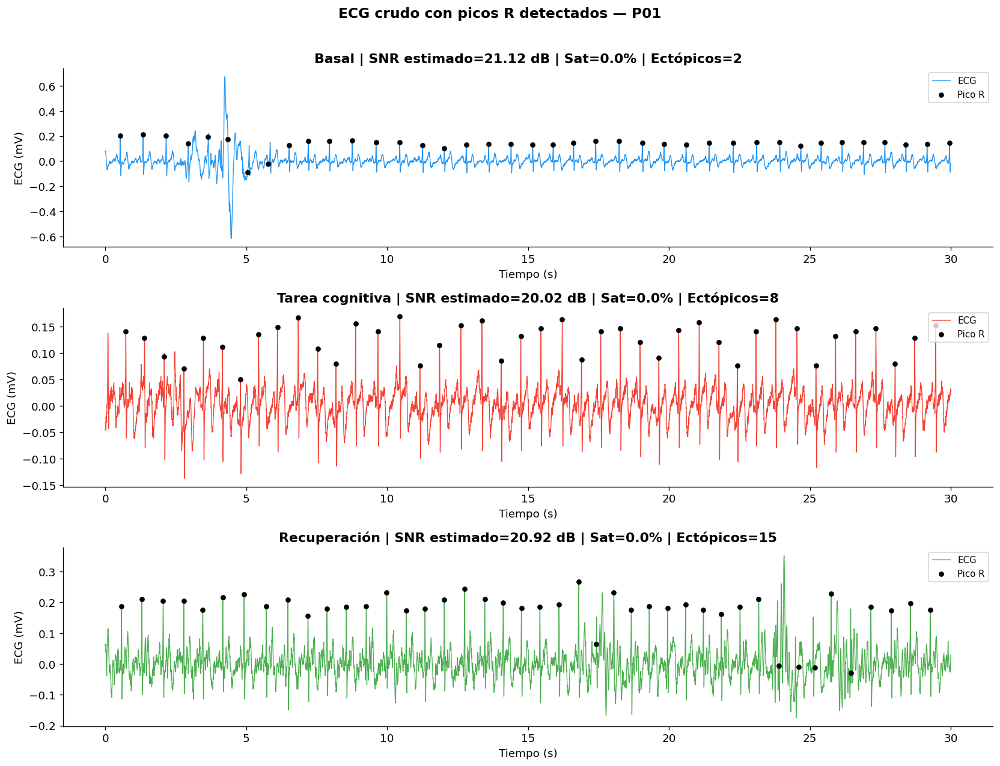
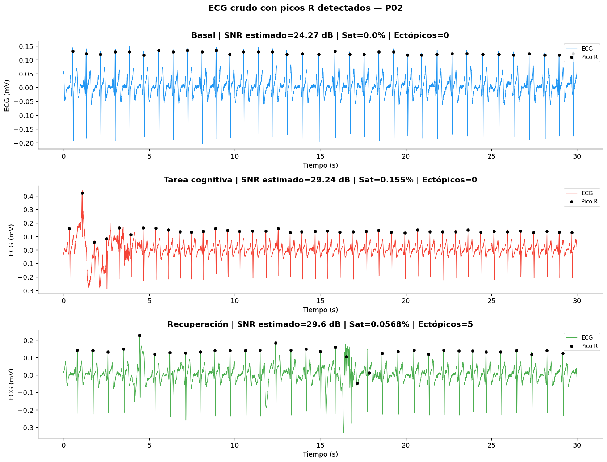
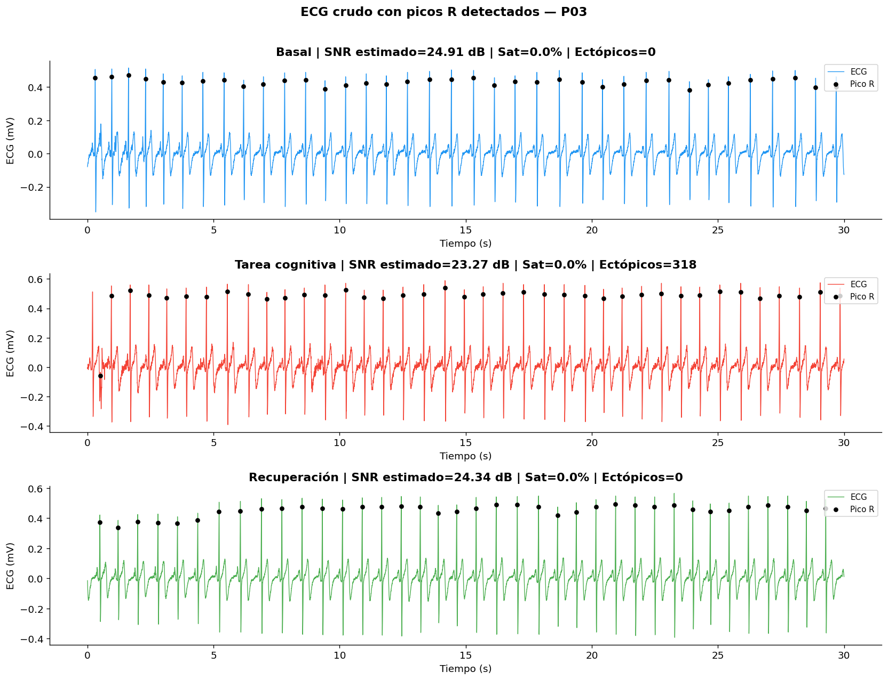
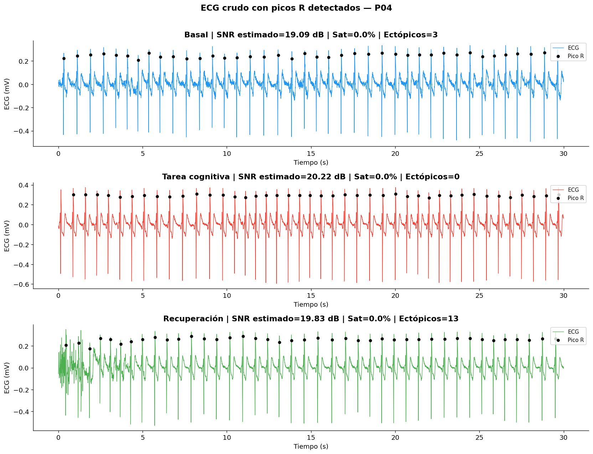


### Distribución de intervalos RR

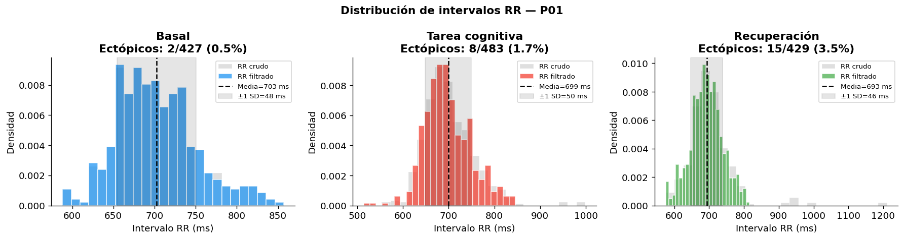
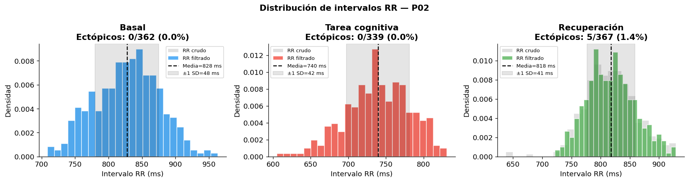
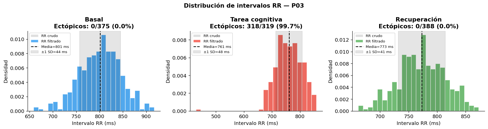
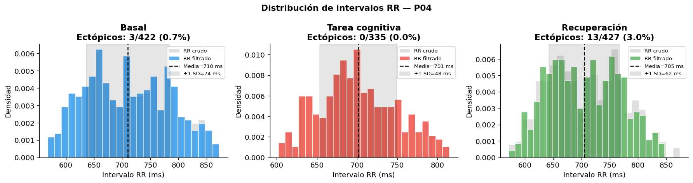


### RMSSD deslizante


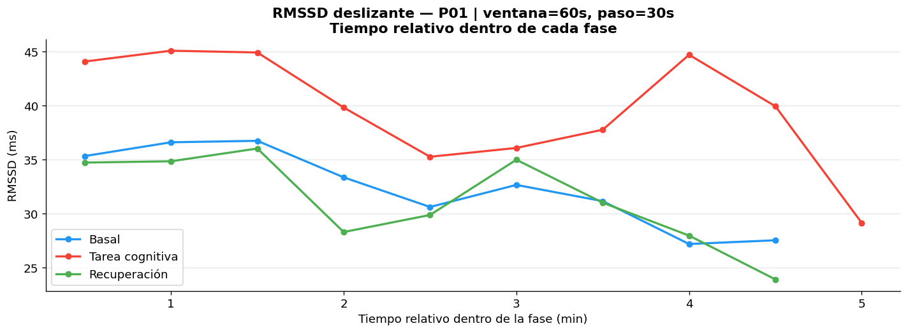
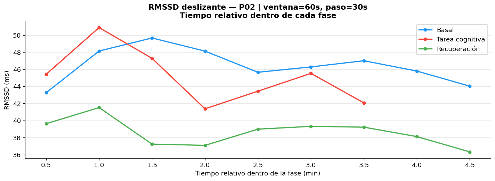
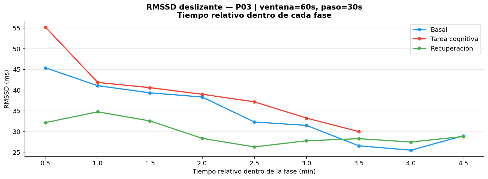
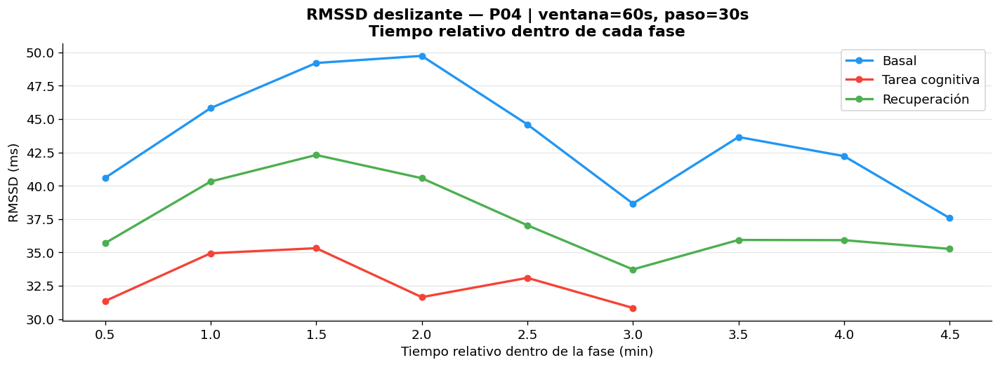


### Comparación global

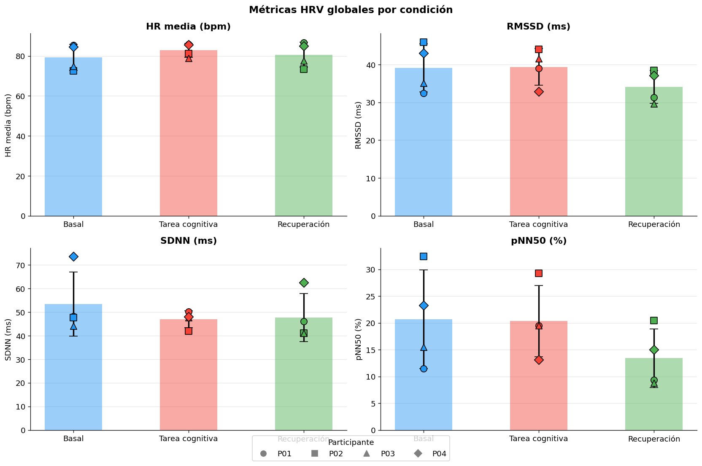


### Perfiles individuales

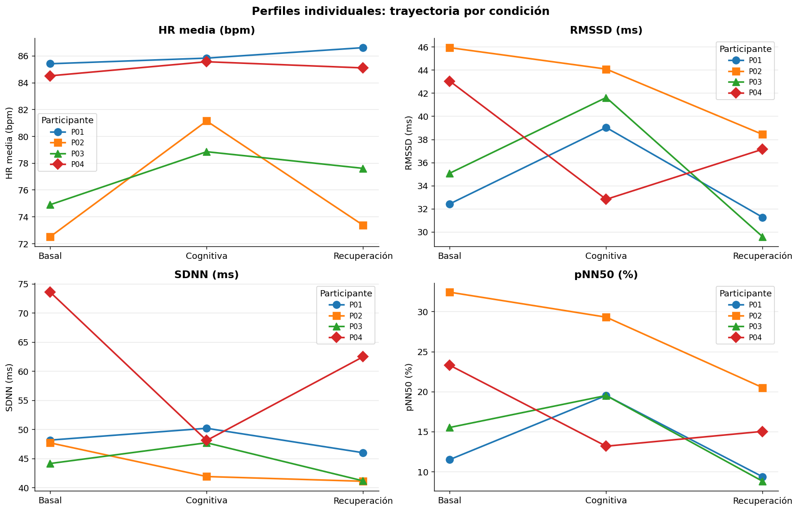


### Porcentaje de recuperación

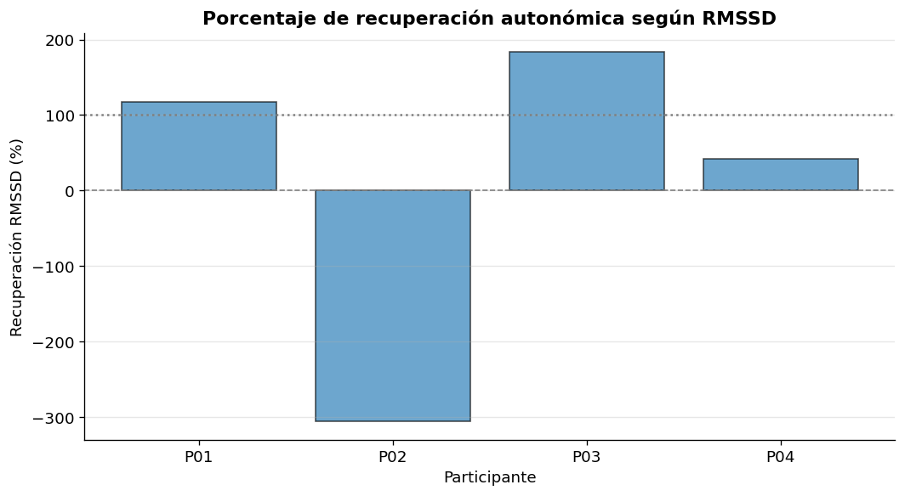


---

## Archivos generados

### Tablas procesadas

| Archivo                        | Descripción                                           |
| ------------------------------ | ----------------------------------------------------- |
| [`tabla_completitud.csv`](Señales/Procesamiento/tabla_completitud.csv) | Verificación de archivos, duración, picos R y calidad |
| [`tabla_HRV_global.csv`](Señales/Procesamiento/tabla_HRV_global.csv) | Métricas HRV globales por participante y condición    |
| [`tabla_recuperacion_RMSSD.csv`](Señales/Procesamiento/tabla_recuperacion_RMSSD.csv) | Cálculo del porcentaje exploratorio de recuperación   |
| [`tabla_RMSSD_ventanas.csv`](Señales/Procesamiento/tabla_RMSSD_ventanas.csv) | RMSSD calculado por ventanas deslizantes              |
| [`tabla_cuestionarios.csv`](Señales/Procesamiento/tabla_cuestionarios.csv) | Registro de PSS-10, NASA-TLX y accuracy 2-back        |
| [`resumen_EDA_HRV_completo.csv`](Señales/Procesamiento/resumen_EDA_HRV_completo.csv) | Resumen completo de calidad, señal y HRV              |

### Código

---

## Limitaciones del avance

* La muestra actual es pequeña: 4 participantes.
* Los resultados son descriptivos y exploratorios.
* No se realizaron pruebas estadísticas inferenciales.
* Algunas fases cognitivas tuvieron duración menor a 5 minutos.
* P03 durante tarea cognitiva presentó un número elevado de intervalos ectópicos.
* P04 durante tarea cognitiva fue marcado para revisión por calidad/duración.
* Los cuestionarios PSS-10, NASA-TLX y accuracy 2-back aún deben integrarse con sus valores reales.
* El porcentaje de recuperación RMSSD solo es directamente interpretable cuando la RMSSD disminuye durante la tarea cognitiva.
* Se requiere revisión visual adicional de los picos R en registros marcados como problemáticos.

---

## Conclusión del avance

El EDA permitió verificar que se cuenta con registros ECG completos para los 4 participantes en las tres fases del protocolo. La mayoría de señales presentó calidad suficiente para un análisis exploratorio inicial, permitiendo detectar picos R, calcular intervalos RR y extraer métricas HRV preliminares.

Los resultados muestran variabilidad individual en la respuesta a la tarea cognitiva. El caso de P04 mostró el patrón más compatible con recuperación autonómica parcial, evidenciado por una disminución de RMSSD durante la tarea cognitiva y un aumento posterior durante recuperación. Sin embargo, debido al tamaño piloto de la muestra y a la presencia de registros que requieren revisión, estos resultados no deben interpretarse como conclusiones definitivas.

Este avance sirve como base para mejorar el protocolo, estandarizar el procesamiento, integrar cuestionarios subjetivos y desarrollar posteriormente un algoritmo de detección de recuperación autonómica.

---

